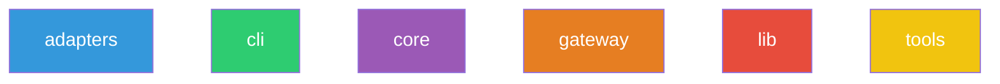
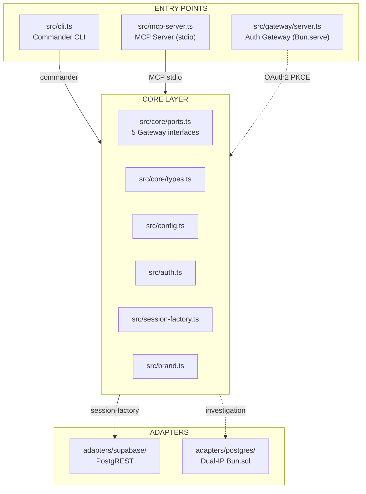
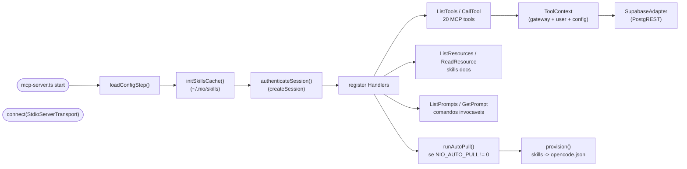
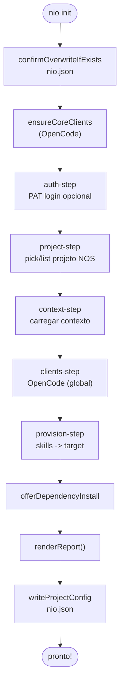
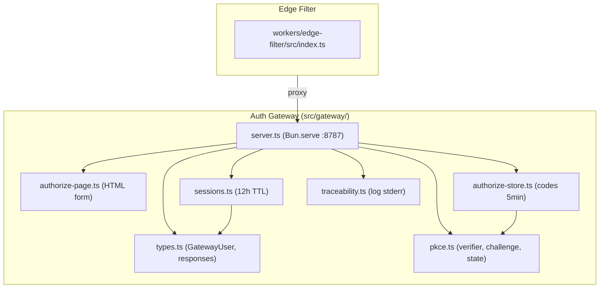
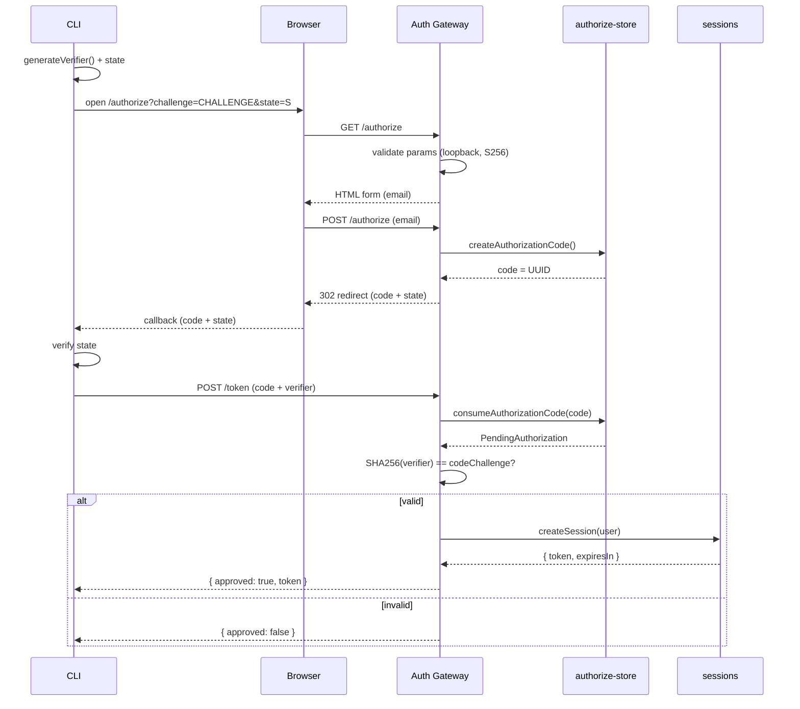
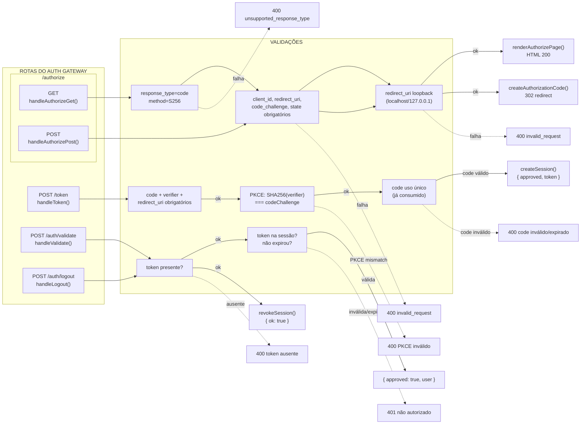
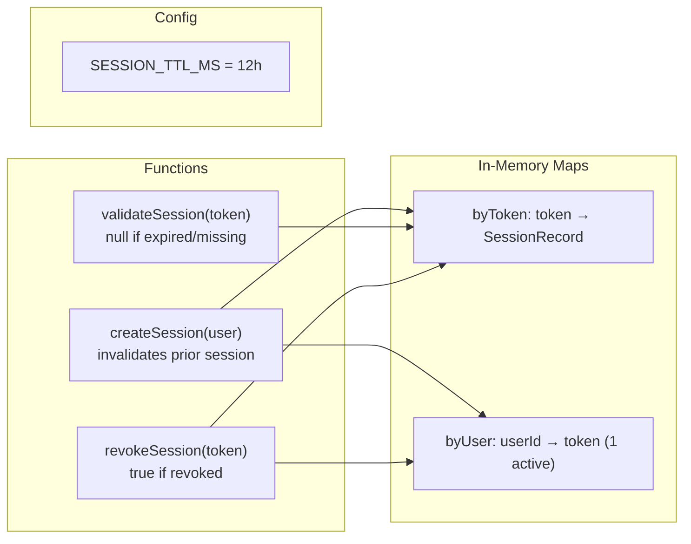
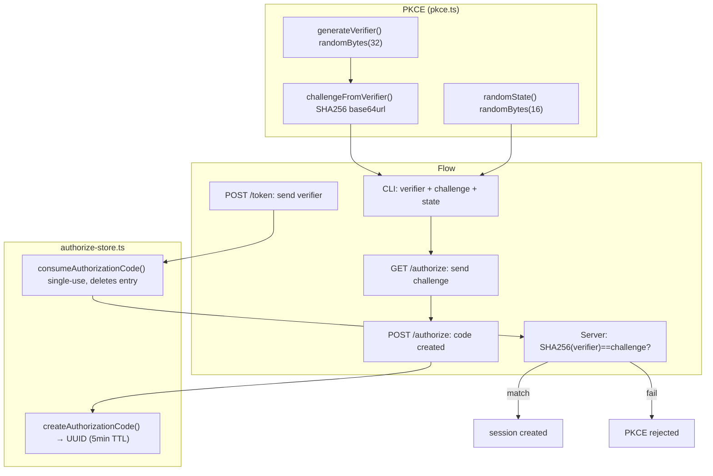
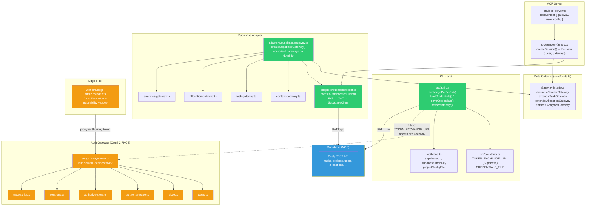

# Diagramas NIO-CLI

## 1. Módulos
6 módulos detectados pela doc-pipeline.

[🎨 Editar](https://l.mermaid.ai/7TTYRv)

---

## 2. Arquitetura Hexagonal
Entry Points → Core Layer → Adapters.

[🎨 Editar](https://l.mermaid.ai/WaqVJS)

---

## 3. Inicialização do MCP Server
Ciclo de vida do servidor stdio.

[🎨 Editar](https://l.mermaid.ai/h8Yosm)

---

## 4. Fluxo `nio init`
Wizard interativo de 11 etapas.

[🎨 Editar](https://l.mermaid.ai/zKRRt6)

---

# Gateway de Segurança

## 5. Arquitetura do Gateway de Auth
8 arquivos do módulo `src/gateway/` + Edge Filter.

[🎨 Editar](https://l.mermaid.ai/f0W5ML)

---

## 6. Fluxo OAuth2 PKCE
Sequência completa: CLI → navegador → autorização → troca por token.

[🎨 Editar](https://l.mermaid.ai/aVzij7)

---

## 7. Rotas HTTP e Validações
4 endpoints e suas validações de parâmetros e respostas de erro.

[🎨 Editar](https://l.mermaid.ai/CLCwsR)

---

## 8. Ciclo de Vida da Sessão
Sessões em memória: createSession, validateSession, revokeSession.

[🎨 Editar](https://l.mermaid.ai/5VHJBH)

---

## 9. Ciclo do Código de Autorização PKCE
Geração do verifier/challenge, criação e consumo do código de uso único.

[🎨 Editar](https://l.mermaid.ai/BMvovz)

---

## 10. Malha de Segurança (Visão Geral)
Relação entre CLI auth, MCP Server, Data Gateway (core/ports), Supabase Adapter, Auth Gateway e Edge Filter.

[🎨 Editar](https://l.mermaid.ai/OPl7qV)

