# Roadmap NIO — escopo atualizado

> **Direcionamento:** NIO read-only sobre o PostgreSQL + análise profunda.
> Toda escrita de domínio migra para o sistema interno. O PostgreSQL passa a ser
> exclusivamente fonte de consulta, observabilidade e rastreio.

Este documento é a fonte única do roadmap. Cada nó do diagrama corresponde a um
item de checklist com o mesmo ID (`P01`, `F11`, `U21`, …), para que diagrama e
plano de execução nunca divirjam.

- **Diagrama:** o bloco `mermaid` abaixo (renderiza no GitHub/GitLab).
- **Visualização com pan/zoom:** [`roadmap-nio-fluxograma.html`](./roadmap-nio-fluxograma.html)
- **Plano de execução (tasks desmembradas):** [`PLANO-EXECUCAO.md`](./PLANO-EXECUCAO.md)
- **ADRs:** [`docs/adr/`](./adr/) — decisões formais, uma por reabertura de premissa
- **Convenção de status:** `[ ]` pendente · `[~]` em andamento · `[x]` concluído

---

## Diagrama

```mermaid
---
title: Roadmap NIO — escopo atualizado
---
flowchart TB
    A(["Direcionamento atualizado<br/>NIO read-only + análise profunda"]):::indigo
    subgraph P0["Fase 0 — Decisões confirmadas"]
        direction TB
        P01["Dois IPs de banco<br/>IP antigo e IP novo"]:::orange
        P02["Cada projeto pode estar<br/>em um dos bancos"]:::orange
        P03["NIO deve alternar o alvo<br/>e aprofundar a pesquisa"]:::orange
        P04["Acesso somente DQL<br/>consultas, observabilidade,<br/>monitoramento e rastreio"]:::orange
        P05["Time tracking inicialmente<br/>local em ~/.nio/"]:::orange
        P06["Usuário escolhe seus grupos<br/>no cadastro do nio init"]:::orange
        P01 --> P02 --> P03
        P04 --> P05 --> P06
    end
    subgraph P1["Fase 1 — Fundação read-only dual-IP"]
        direction TB
        F11["Rebrand noclaf → nio<br/>@nio-cli/cli, @nio-cli/skills e NIO_"]:::teal
        F12["Adapter PostgreSQL<br/>com dois destinos configuráveis"]:::teal
        F13["Seleção de banco por projeto<br/>ou contexto de consulta"]:::teal
        F14["Descoberta de schema e conteúdo<br/>information_schema + tabelas"]:::teal
        F15["Role sem DML, DDL e DTL<br/>permitir somente DQL"]:::teal
        F16["Observabilidade da consulta<br/>tempo, origem, banco e rastreio"]:::teal
        F11 --> F12 --> F13 --> F14
        F14 --> F15 --> F16
    end
    subgraph P2["Fase 2 — Identidade, grupos e contexto"]
        direction TB
        U21["nio init<br/>email, usuário e identidade local"]:::green
        U22["Listar grupos disponíveis<br/>para o usuário escolher"]:::green
        U23["Persistir memberships<br/>many-to-many em nio.json"]:::green
        U24["Derivar tool prefix<br/>por usuário"]:::green
        U25["Selecionar projetos, bancos<br/>e escopos de investigação"]:::green
        U26["Revalidar grupos e conexão<br/>sem alterar o PostgreSQL"]:::green
        U21 --> U22 --> U23 --> U24 --> U25 --> U26
    end
    subgraph P3["Fase 3 — Tools do core read-only"]
        direction TB
        T31["Manter tools de contexto<br/>projetos e seleção ativa"]:::cyan
        T32["Manter tools de consulta de tasks<br/>list, get e relações"]:::cyan
        T33["Manter tools de alocação<br/>leitura e consulta de histórico"]:::cyan
        T34["Manter tools de análise<br/>datasets, contexto e rastreio"]:::cyan
        T35["Time tracking local<br/>sem persistência no banco"]:::cyan
        T36["Remover somente a execução<br/>de escrita no PostgreSQL"]:::red
        T31 --> T32 --> T33 --> T34
        T34 --> T35
        T36 --> T35
    end
    subgraph P4["Fase 4 — Sistema interno"]
        direction TB
        I41["Implementar operations de tasks<br/>no sistema interno"]:::violet
        I42["createTask, updateTask,<br/>moveTask e commentTask"]:::violet
        I43["recordDelivery e operações<br/>de workflow interno"]:::violet
        I44["Adapter interno separado<br/>HTTP ou gRPC"]:::violet
        I45["Manter o adapter PostgreSQL<br/>exclusivamente read-only"]:::violet
        I46["Roteamento por capacidade<br/>consulta externa versus operação interna"]:::violet
        I41 --> I42 --> I43 --> I44 --> I45 --> I46
    end
    subgraph P5["Fase 5 — Investigação e engenharia de dados"]
        direction TB
        D51["Explorar conteúdo das tabelas<br/>não apenas nomes e metadados"]:::sky
        D52["Consultas complexas<br/>joins, filtros e agregações"]:::sky
        D53["Monitoramento e observabilidade<br/>por banco, projeto e consulta"]:::sky
        D54["Análise de datasets<br/>pipelines e dependências"]:::sky
        D55["Skill review-sql<br/>e validações de runtime"]:::sky
        D51 --> D52 --> D53 --> D54 --> D55
    end
    subgraph P6["Fase 6 — Refatoração estrutural controlada"]
        direction TB
        R61["R1 — Organizar src/lib<br/>por domínio"]:::fuchsia
        R62["R2 — Consolidar skills<br/>model, cache, serve e filter"]:::fuchsia
        R63["R4 — Centralizar clientes IA<br/>targets, instalação e configs"]:::fuchsia
        R64["R5/R6 — Organizar dependencies<br/>e hooks"]:::fuchsia
        R65["R3 — Unificar engines<br/>de execução local"]:::fuchsia
        R66["R10 — Dividir task-gateway<br/>sem alterar ports públicos"]:::yellow
        R61 --> R62 --> R63
        R61 --> R64
        R61 --> R65
        R66 -.-> R61
    end
    subgraph P7["Fase 7 — Escala futura"]
        direction TB
        G71["SQLite local<br/>quando JSON atingir limite"]:::lime
        G72["Cache de consultas com TTL"]:::lime
        G73["Lock e controle de concorrência<br/>no MCP"]:::lime
        G74["Lineage passivo e alertas<br/>de dados desatualizados"]:::lime
        G75["Catálogo corporativo<br/>DataHub, Amundsen ou OpenMetadata"]:::lime
        G71 --> G72 --> G73 --> G74 --> G75
    end
    A --> P0
    P06 --> P1
    P1 --> P2
    P2 --> P3
    P3 --> P4
    P3 --> P5
    P4 --> P5
    P5 --> P6
    P6 --> P7
    classDef indigo fill:#eef2ff,stroke:#818cf8,color:#1e1b4b,stroke-width:2px
    classDef orange fill:#fff7ed,stroke:#fb923c,color:#431407
    classDef teal fill:#f0fdfa,stroke:#2dd4bf,color:#134e4a
    classDef green fill:#f0fdf4,stroke:#4ade80,color:#14532d
    classDef red fill:#fef2f2,stroke:#f87171,color:#7f1d1d
    classDef cyan fill:#ecfeff,stroke:#22d3ee,color:#164e63
    classDef violet fill:#f5f3ff,stroke:#a78bfa,color:#4c1d95
    classDef sky fill:#f0f9ff,stroke:#38bdf8,color:#0c4a6e
    classDef fuchsia fill:#fdf4ff,stroke:#e879f9,color:#701a75
    classDef yellow fill:#fefce8,stroke:#facc15,color:#713f12
    classDef lime fill:#f7fee7,stroke:#a3e635,color:#365314
```



---

## Fase 0 — Decisões confirmadas

Premissas fechadas. Não reabrir sem ADR.

- [x] **P01** — Dois IPs de banco: IP antigo e IP novo — [ADR 0001](./adr/0001-nio-readonly-dual-ip.md)
- [x] **P02** — Cada projeto pode estar em um dos bancos — [ADR 0001](./adr/0001-nio-readonly-dual-ip.md)
- [x] **P03** — NIO deve alternar o alvo e aprofundar a pesquisa — [ADR 0001](./adr/0001-nio-readonly-dual-ip.md)
- [x] **P04** — Acesso somente DQL: consultas, observabilidade, monitoramento e rastreio — [ADR 0001](./adr/0001-nio-readonly-dual-ip.md)
- [x] **P05** — Time tracking inicialmente local em `~/.nio/` — [ADR 0001](./adr/0001-nio-readonly-dual-ip.md)
- [x] **P06** — Usuário escolhe seus grupos no cadastro do `nio init` — [ADR 0002](./adr/0002-perfil-como-grupo.md)

**Saída da fase:** decisões registradas; `P06` destrava a Fase 1. ✅ Fase 0
concluída em 2026-07-27 — Fase 1 (F11: rebrand) já em andamento em paralelo,
ver `PLANO-EXECUCAO.md`.

---

## Fase 1 — Fundação read-only dual-IP

Depende de: `P06`

- [ ] **F11** — Rebrand `noclaf` → `nio` (`@nio-cli/cli`, `@nio-cli/skills`, prefixo de env `NIO_`)
- [ ] **F12** — Adapter PostgreSQL com dois destinos configuráveis
- [ ] **F13** — Seleção de banco por projeto ou por contexto de consulta
- [ ] **F14** — Descoberta de schema e conteúdo (`information_schema` + tabelas)
- [ ] **F15** — Role sem DML, DDL e DTL — permitir somente DQL
- [ ] **F16** — Observabilidade da consulta: tempo, origem, banco e rastreio

**Critério de pronto:** uma consulta arbitrária roda contra qualquer um dos dois
IPs, com o banco escolhido explicitamente, e é impossível emitir escrita mesmo
que a query tente.

---

## Fase 2 — Identidade, grupos e contexto

Depende de: Fase 1

- [ ] **U21** — `nio init`: email, usuário e identidade local
- [ ] **U22** — Listar grupos disponíveis para o usuário escolher
- [ ] **U23** — Persistir memberships many-to-many em `nio.json`
- [ ] **U24** — Derivar tool prefix por usuário
- [ ] **U25** — Selecionar projetos, bancos e escopos de investigação
- [ ] **U26** — Revalidar grupos e conexão sem alterar o PostgreSQL

**Critério de pronto:** dois usuários no mesmo host têm identidades, grupos e
prefixos de tool distintos, sem nenhuma escrita no PostgreSQL.

---

## Fase 3 — Tools do core read-only

Depende de: Fase 2

- [ ] **T31** — Manter tools de contexto: projetos e seleção ativa
- [ ] **T32** — Manter tools de consulta de tasks: `list`, `get` e relações
- [ ] **T33** — Manter tools de alocação: leitura e consulta de histórico
- [ ] **T34** — Manter tools de análise: datasets, contexto e rastreio
- [ ] **T35** — Time tracking local, sem persistência no banco
- [ ] **T36** — Remover **somente** a execução de escrita no PostgreSQL ⚠️

> ⚠️ **T36 é o único ponto de remoção.** Nada mais é apagado nesta fase — as
> tools de leitura, contexto e análise permanecem intactas. `T36` e `T34`
> convergem em `T35`.

**Critério de pronto:** superfície de tools inalterada para o usuário, exceto
pela ausência de qualquer caminho de escrita no PostgreSQL.

---

## Fase 4 — Sistema interno

Depende de: Fase 3

- [ ] **I41** — Implementar operations de tasks no sistema interno
- [ ] **I42** — `createTask`, `updateTask`, `moveTask` e `commentTask`
- [ ] **I43** — `recordDelivery` e operações de workflow interno
- [ ] **I44** — Adapter interno separado (HTTP ou gRPC)
- [ ] **I45** — Manter o adapter PostgreSQL exclusivamente read-only
- [ ] **I46** — Roteamento por capacidade: consulta externa versus operação interna

**Critério de pronto:** toda escrita de domínio passa pelo adapter interno; o
roteador nunca envia uma operação de escrita para o adapter PostgreSQL.

---

## Fase 5 — Investigação e engenharia de dados

Depende de: Fase 3 e Fase 4

- [ ] **D51** — Explorar conteúdo das tabelas, não apenas nomes e metadados
- [ ] **D52** — Consultas complexas: joins, filtros e agregações
- [ ] **D53** — Monitoramento e observabilidade por banco, projeto e consulta
- [ ] **D54** — Análise de datasets, pipelines e dependências
- [ ] **D55** — Skill `review-sql` e validações de runtime

**Critério de pronto:** é possível investigar um dataset desconhecido de ponta a
ponta — schema, conteúdo, dependências — só com as tools do NIO.

---

## Fase 6 — Refatoração estrutural controlada

Depende de: Fase 5. **Só começa com o comportamento já estabilizado.**

- [ ] **R61 — R1** — Organizar `src/lib` por domínio *(raiz da fase; destrava R62, R64 e R65)*
- [ ] **R62 — R2** — Consolidar skills: `model`, `cache`, `serve` e `filter`
- [ ] **R63 — R4** — Centralizar clientes IA: targets, instalação e configs
- [ ] **R64 — R5/R6** — Organizar dependencies e hooks
- [ ] **R65 — R3** — Unificar engines de execução local
- [ ] **R66 — R10** — Dividir `task-gateway` sem alterar ports públicos

Ordem de execução:

```
R61 ──► R62 ──► R63
  ├───► R64
  └───► R65

R66 ┄┄► R61        (dependência fraca: R10 informa R1, não bloqueia)
```

**Regra da fase:** refatoração é *mecânica*. Nenhuma mudança de comportamento,
nenhum port público alterado. Um commit por item `R*`, cada um reversível
isoladamente.

---

## Fase 7 — Escala futura

Depende de: Fase 6. Só puxar quando houver dor real medida.

- [ ] **G71** — SQLite local quando o JSON atingir o limite
- [ ] **G72** — Cache de consultas com TTL
- [ ] **G73** — Lock e controle de concorrência no MCP
- [ ] **G74** — Lineage passivo e alertas de dados desatualizados
- [ ] **G75** — Catálogo corporativo: DataHub, Amundsen ou OpenMetadata

---

## Invariantes do projeto

Valem em **todas** as fases. Qualquer PR que viole um destes é rejeitado:

1. O adapter PostgreSQL é **read-only**. Somente DQL — sem DML, DDL ou DTL.
2. Escrita de domínio existe **apenas** no adapter do sistema interno.
3. Toda consulta é observável: tempo, origem, banco alvo e rastreio.
4. O banco alvo é sempre **explícito** — nunca inferido por default silencioso.
5. Refatoração (Fase 6) não altera comportamento nem ports públicos.

---

## Como manter este documento

- O bloco `mermaid` acima é a fonte do diagrama. Ao mudar um nó, mude também o
  item de checklist correspondente — os IDs precisam bater.
- IDs são estáveis: nunca renumere. Item cancelado vira `~~**Xnn**~~ (descartado: motivo)`.
- Mudança de premissa da Fase 0 exige um ADR em `docs/adr/`, não uma edição silenciosa aqui.
