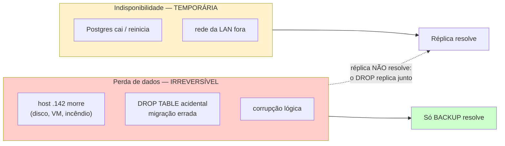

# ADR 0014 — Durabilidade e replicação do Postgres

- **Status:** proposto
- **Data:** 2026-09-28
- **Contexto do pedido:** eliminar o SPOF do Postgres antes de tratar produção como estável.

> **Nota de numeração.** Os arquivos de ADR 0001–0010 foram removidos do repo
> (`53c30ee` e `3e8f9b3`), mas **os números seguem em uso**: 0011, 0012 e 0013 são
> citados no código e nos docs de arquitetura (ex.: `index.ts` cita "ADR 0012" para
> retenção de `auth_events`; `ADR 0011 §F` para `login_ip_events`). Por isso este é
> **0014**, e não 0011. Antes de criar o próximo, confira o maior número *citado*,
> não o maior arquivo existente.

## Contexto

O `nio_cli` é a fonte da verdade do domínio: `sessions`, `user_cli` (hash argon2id),
`auth_sessions`, `login_challenges` e o RAG de DAX. Se ele some, a CLI inteira para —
não há cache local de sessão (`~/.nio/` guarda só JWT e config por-usuário).

Medido na instância em produção em 2026-09-28 (consultas de catálogo, read-only):

| Item | Valor |
|---|---|
| Versão | PostgreSQL 17.7 (Debian 17.7-0+deb13u1) |
| Papel | primary (`pg_is_in_recovery() = false`) |
| Standbys conectados | **0** (`pg_stat_replication`) |
| Slots de replicação | **0** |
| `wal_level` | **`replica`** — já suficiente para streaming |
| `archive_mode` | **`off`** — sem PITR |
| Tamanho do banco | **19 MB** |
| Endereço | `192.168.0.142:5432` |

Busca por ferramenta de backup versionada (`pg_dump`/`pg_basebackup` em
`scripts/`, `.github/`, `docker/`): **nenhuma**. As ocorrências de "backup" nos
docs são sobre *backup codes* do 2FA, não do banco.

**Não verificado:** se existe snapshot de VM/Proxmox ou dump manual no host. Nada
disso é versionado nem documentado, então não é reproduzível nem auditável — para
efeito desta decisão, trata-se como inexistente até prova em contrário.

## O problema real: dois riscos distintos, frequentemente confundidos



O ponto que decide esta ADR: **réplica não é backup.** Um `DROP TABLE` ou uma
migração errada chega ao standby em milissegundos. Streaming replication protege
contra *host morto*, não contra *erro humano* — e erro humano em migração é o
cenário mais provável aqui, dado que `db/schema.sql` é mantido à mão e o CI já
pegou um caso de divergência.

Hoje o projeto não tem proteção contra **nenhum** dos dois. Perda de dados é
irreversível; indisponibilidade não é. Pela hierarquia de decisão do harness
(Correção → **Segurança e integridade de dados** → Operabilidade), durabilidade
vem antes de disponibilidade.

## Alternativas consideradas

| # | Opção | RPO | RTO | Custo | Protege contra erro humano |
|---|---|---|---|---|---|
| A | Status quo | ∞ (perde tudo) | ∞ (recriar do zero) | 0 | ❌ |
| **B** | **`pg_dump` agendado + retenção + restore testado** | **≤ intervalo (6 h)** | **minutos** (19 MB) | **~0** | **✅** |
| C | B + `archive_mode=on` (PITR) | ~minutos | minutos | baixo (disco WAL) | ✅ |
| D | Streaming replica (hot standby) | ~0 | minutos (failover manual) | +1 host + monitoramento | ❌ |
| E | Postgres gerenciado (Azure/RDS) | ~0 | automático | $$ + migração + latência LAN→nuvem | ✅ |

## Decisão

**Adotar B agora. C e D ficam condicionados a gatilho explícito, não a calendário.**

1. **Agora — B:** `pg_dump` (custom format) a cada 6 h, retenção 7 diários + 4
   semanais, destino em host distinto do `.142`, e **um restore testado** antes de
   considerar a task pronta. Backup que nunca foi restaurado é hipótese, não backup.
2. **Gatilho para C (PITR):** quando a perda de até 6 h de dados deixar de ser
   aceitável — na prática, quando houver escrita de terceiros/cliente no banco.
   `wal_level` já está em `replica`; ligar `archive_mode` exige restart.
3. **Gatilho para D (réplica):** quando uma queda do `.142` custar mais que o
   incômodo de esperar o restore — ou seja, quando a CLI virar dependência de
   alguém fora do time interno. Só então o +1 host se paga.
4. **E fica descartado** enquanto o banco for 19 MB num time interno: a migração e
   a latência LAN→nuvem custam mais do que o problema que resolvem.

### Por que não começar pela réplica (a proposta original)

Porque ela não cobre o risco irreversível, custa um host a mais e adiciona
failover manual para operar — complexidade que, pelo harness, precisa nomear a
falha concreta que evita. A falha que ela evita (downtime) é hoje *tolerável*;
a que ela **não** evita (perda de dados) é a que não tem volta.

## Consequências

**Aceitas:**
- Janela de perda de até 6 h entre dumps. Aceitável para dados que são, em
  grande parte, reconstruíveis (sessões de ambiente, eventos de dependência).
  `user_cli` é o que realmente dói — e é o que menos muda.
- Restore é manual. Com 19 MB é questão de minutos, não justifica automação ainda.
- SPOF de disponibilidade **permanece**, conscientemente, até o gatilho de D.

**Ganhos:**
- O risco irreversível sai do mapa pelo custo mais baixo disponível.
- `wal_level=replica` já posiciona C e D como incrementais, não como reescrita.

## Plano de reversão

B é aditivo: nada no caminho de execução da CLI muda. Reverter = desligar o
agendamento e apagar os dumps. Sem migração, sem alteração de schema, sem
downtime. Reversível em minutos.

## Como verificar que está valendo

```bash
# o dump mais recente tem menos de 6h e não é vazio
ls -la <destino>/nio_cli-*.dump | tail -1

# o restore funciona (num banco descartável, NUNCA no de produção)
pg_restore --clean --if-exists -d nio_cli_restore_test <dump>
psql -d nio_cli_restore_test -c "SELECT count(*) FROM user_cli;"
```

O critério de pronto da task é a **segunda** linha, não a primeira.

## Referências

- `src/adapters/pg/client.ts` — pool único, TLS, `NIO_DATABASE_URL`.
- `db/schema.sql` + `db/migrations/` — fonte da verdade do schema (mantido à mão).
- ADR 0001 (`0001-nio-readonly-dual-ip.md`) foi **removido** em `53c30ee` como
  spec superada; a topologia dual-IP daquele desenho não vale mais — hoje é uma
  instância só, em `NIO_DATABASE_URL`.
