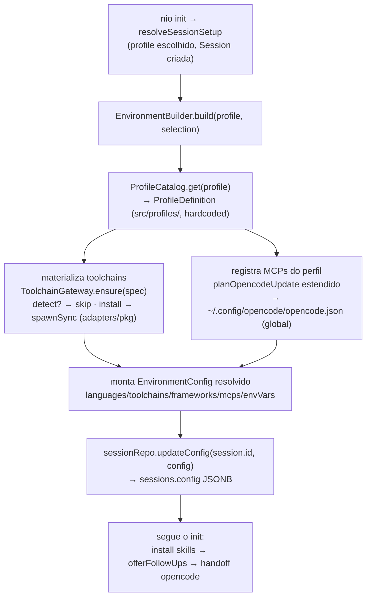

# Arquitetura do EnvironmentBuilder (perfil → ambiente materializado)

> Documento de referência — mapa do pipeline que **materializa** o ambiente de
> uma sessão a partir do `Profile` escolhido no `nio init`. É a peça grande que
> fecha o redesenho do `init`: hoje o perfil escolhido só vira a string
> `sessions.profile` + filtro de skills; a partir daqui ele passa a **instalar
> toolchains e registrar MCPs** de verdade, populando `sessions.config`.
>
> Levantado em **25 ago 2026** lendo o código. Decisões de escopo travadas com
> o dono do projeto na mesma data (ver "Decisões travadas").

## Resumo executivo

O `Profile` (`fullstack`/`analyst`/`scientist`/`dba`/`qa`/`bi`) passa a mapear
para um **`ProfileDefinition`** — um catálogo hardcoded (`src/profiles/`) que
declara o que o perfil precisa: linguagens, toolchains, frameworks, **MCPs** e
env/aliases. O **`EnvironmentBuilder`** (app layer) lê esse catálogo, materializa
o ambiente (instala toolchains via `adapters/pkg/`, grava os MCPs do perfil no
`opencode.json`) e devolve um `EnvironmentConfig` resolvido, que é persistido em
`sessions.config` (JSONB). Roda dentro do `nio init`, entre a criação da
`Session` e o handoff pro OpenCode.

## O que já existe (confirmado lendo o código, 25 ago 2026)

O **alvo e a persistência já estão modelados** — falta quem produza o dado.

| Peça | Estado |
|---|---|
| `EnvironmentConfig` (shape do `sessions.config`): `languages[]`, `toolchains[]`, `frameworks[]`, `mcps[]`, `envVars`, `aliases`, `extra` (`src/core/types.ts:30`) | ✅ tipo definido |
| `sessions.config JSONB` + índice GIN (`db/schema.sql:31,39`) | ✅ coluna pronta |
| `SessionRepository.updateConfig(id, config)` e `NewSessionInput.config?` (`src/core/repositories.ts:42,68`) | ✅ escritor pronto |
| `Profile` union + `pickProfile` no wizard (`src/core/types.ts:13`, `init/profile-step.ts`) | ✅ |
| Infra de instalação: `spawnSync` sem shell, allowlist por regex, marcador de idempotência (`~/.nio/installed-deps.json`), detecção por glob (`src/lib/dependency-install.ts`, `dependencies.ts`) | ✅ **reaproveitar** no `ToolchainGateway` — não reinventar |
| `installOpencodeGlobal` / `planOpencodeUpdate` — merge defensivo do `mcp.nio` no `opencode.json` (`src/lib/client-configs.ts:257,290`) | ✅ **estender** pra fundir MCPs do perfil |
| **`src/profiles/` (catálogo)** — CLAUDE.md promete, não existe | ❌ |
| **Ports `ProfileCatalog` / `ToolchainGateway`** — CLAUDE.md lista, não existem | ❌ |
| **`app/EnvironmentBuilder`** | ❌ não existe |
| Quem popula `sessions.config` | ❌ **ninguém** — `resolveSessionSetup` cria a Session com `config: {}` |
| MCPs por perfil no `opencode.json` | ❌ `installOpencodeGlobal` só escreve o MCP `nio` |

## Decisões travadas (25 ago 2026)

1. **Escopo da 1ª fatia: MCPs + toolchains.** A primeira versão já instala
   linguagens/toolchains via `adapters/pkg/` **e** grava os MCPs do perfil — não
   é só MCPs. Isso torna a fatia maior e com superfície de erro real
   (instalação de software), então a ordem incremental abaixo isola cada risco.
2. **`opencode.json` global** (`~/.config/opencode/opencode.json`), como o
   `mcp.nio` já hoje. Mais simples, um caminho só.
   **Limitação assumida:** a config é por-máquina, não por-sessão — rodar
   `nio init` com outro perfil noutra pasta **sobrescreve** os MCPs do perfil
   anterior no mesmo arquivo global. Aceitável por agora (1 sessão ativa por
   usuário de qualquer forma); se virar problema, migrar pra `opencode.json` de
   projeto é uma sub-tarefa separada (ver "Questões em aberto").
3. **Catálogo hardcoded** em `src/profiles/` (regra da CLAUDE.md: perfis fixos no
   fonte; novo perfil só entra alterando código). Sem tabela de perfis no banco.

## `ProfileDefinition` — o shape do catálogo (proposto)

```ts
// src/profiles/types.ts (core, sem IO)
export interface McpSpec {
  id: string;                          // chave no opencode.json (ex.: "postgres-producao")
  command: string[];                   // binário + args (formato OpenCode)
  environment?: Record<string, string>;
}
export interface ToolchainSpec {
  id: string;                          // "node", "python", "postgresql-client"…
  detect?: string[];                   // globs — se existir, já instalado (reusa globExists)
  install?: { program: string; args: string[] }; // plano spawnSync sem shell
}
export interface ProfileDefinition {
  profile: Profile;
  languages: string[];
  toolchains: ToolchainSpec[];
  frameworks: string[];
  mcps: McpSpec[];
  envVars?: Record<string, string>;
  aliases?: Record<string, string>;
}
```

O `EnvironmentConfig` (já existente, o que vai pro `sessions.config`) é o
**resultado resolvido** disto — `toolchains: string[]` (ids do que foi
materializado), `mcps: string[]` (ids registrados), etc.

## MCPs base (todo perfil)

Alguns MCPs valem para **qualquer** perfil e não devem ser declarados um a um
(nem esquecidos num perfil novo). Ficam em `BASE_MCPS` no `EnvironmentBuilder` e
são mesclados antes dos específicos (`mergeMcps`, dedupe por `id` — o perfil vence
se repetir). Hoje:

- **`context7`** (`@upstash/context7-mcp`) — doc atualizada de linguagens/
  frameworks sob demanda, pro operador não depender só do conhecimento congelado
  do modelo. Roda anônimo (`CONTEXT7_API_KEY` opcional).

## Diagrama do pipeline



## Onde encaixa no `nio init`

`src/cli/commands/init/index.ts`, dentro de `resolveSessionSetup` (hoje cria a
Session com `config: {}`):

```
5. resolveSessionSetup
   ├─ pickProfile / pickSessionName / promptSelection / pickIde
   ├─ session = sessionRepo.create({ ... })          // config ainda {}
   ├─ ★ env = await EnvironmentBuilder.build(profile, config.selection)
   ├─ ★ await sessionRepo.updateConfig(session.id, env)
   └─ persistConfigStep / writeHarnessStep
6. installAndProvisionClients
   └─ installClients → opencode.json ganha mcp.nio + os MCPs do perfil (passo ★E)
```

Nota de acoplamento: o passo **E** (MCPs no `opencode.json`) e o
`installOpencodeGlobal` do passo 6 tocam o **mesmo arquivo**. Decidir se o
`EnvironmentBuilder` chama a escrita do opencode.json direto, ou se só devolve os
`McpSpec[]` e quem escreve é o `installClients` (passo 6) — **recomendado o
segundo**: builder puro-ish (decide *o quê*), `client-configs.ts` faz o IO
(*onde/como*), um lugar só mexe no `opencode.json`.

## Ordem de construção incremental (tracer-bullet, hexagonal)

Cada passo termina com `bunx tsc --noEmit` limpo e `bun test` verde.

1. **`src/profiles/` + `ProfileDefinition`** (core puro, sem IO) — começar por
   **1 perfil** de ponta a ponta (`dba` ou `analyst`, MCPs óbvios: Postgres /
   PowerBI) em vez dos 6. `ProfileCatalog.get()` + teste do catálogo.
2. **MCPs → `opencode.json`**: estender `planOpencodeUpdate` pra fundir
   `McpSpec[]` do perfil junto do `mcp.nio` (mesmo spread defensivo que já
   existe; não apagar chaves do usuário). Teste: perfil com 1 MCP → chave
   aparece; idempotência; não derruba `mcp.nio`.
3. **`EnvironmentBuilder` (só MCPs ainda) + plug no `resolveSessionSetup`** →
   `updateConfig`. **Fatia vertical visível**: `sessions.config` populado +
   MCP do perfil no `opencode.json`. Sem instalar toolchain ainda.
4. **`ToolchainGateway` + `adapters/pkg/`** — `ensure(spec)`: `detect?` reusa
   `globExists`; `install` reusa o padrão `spawnSync` de `runDependencyInstall`
   (sem shell, args em array). Marcador de idempotência. Começar com **1
   toolchain**. É o passo de maior risco (instala software de verdade) — isolá-lo.
5. **envVars/aliases → dotfiles/shell** — fase 3, menor prioridade.
6. Completar os 6 perfis no catálogo.
7. Atualizar `docs/PROGRESSO.md` a cada fatia entregue.

## Questões em aberto

- **Rollback / falha parcial:** se a instalação de um toolchain falha no meio,
  o que vai pra `sessions.config`? Proposta: `EnvironmentBuilder` registra só o
  que materializou com sucesso; toolchain que falhou vira aviso, não aborta a
  sessão (o ambiente é incremental — a Session já existe, o watcher de
  dependências pode completar depois).
- **Auth dos MCPs externos:** Postgres precisa de `NIO_DATABASE_URL`/credencial,
  PowerBI precisa de login — o `McpSpec.environment` cobre o que é env var, mas
  segredo interativo (login de MCP) não é resolvível no `init` silenciosamente.
  Mapear por MCP o que é env vs. o que exige passo manual pós-handoff.
- **`opencode.json` global vs. projeto** — decidido global por ora (decisão 2);
  registrado aqui como a primeira coisa a revisitar se perfis diferentes por
  repo virarem necessidade.
- **Relação com `Selection` (roles/stacks):** `Selection` já dirige skills/
  provisionamento (nio.json) — é ortogonal ao `Profile`. Decidir se o
  `EnvironmentBuilder` também lê `Selection` pra afinar frameworks, ou se
  `Profile` sozinho basta pra materializar o ambiente.
- **Lock do modelo:** ortogonal — já resolvido (soft default `big-pickle`, ver
  `ARQUITETURA-CLIENTE-IA.md`).

## Referências

- `docs/arch/ARQUITETURA-CLIENTE-IA.md` — operador fixo (OpenCode/big-pickle),
  handoff do `init`; o `EnvironmentBuilder` roda antes do handoff.
- `src/core/types.ts` (`EnvironmentConfig`), `src/core/repositories.ts`
  (`SessionRepository.updateConfig`), `src/lib/client-configs.ts`
  (`planOpencodeUpdate`), `src/lib/dependency-install.ts` (padrão de instalação).
- `CLAUDE.md` — regra do hexágono, perfis hardcoded, `adapters/pkg/`.
