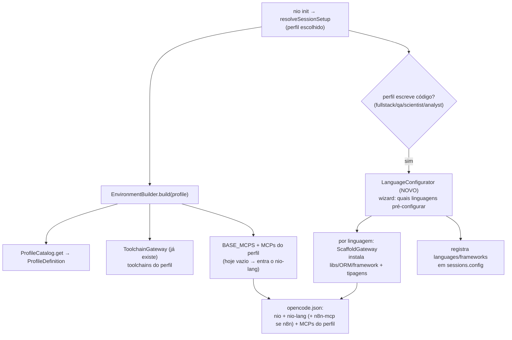

# Arquitetura — `nio-lang` (MCP server nativo de linguagens)

> Documento de referência. O `nio-lang` é o **MCP server nativo da CLI** que
> centraliza a configuração de linguagens (Python, TypeScript, Node.js, C#, n8n)
> — tanto **(A)** o tooling de MCP em cada linguagem quanto **(B)** o ambiente
> geral (libs, ORMs, frameworks, tipagens, sintaxe/semântica). Substitui o papel
> do context7 (doc genérica) por uma base **curada, versionada e controlada**.
>
> Compõe a arquitetura já existente (`EnvironmentBuilder`, `ProfileCatalog`,
> `McpSpec`) — estende, não substitui. Levantado em 25 ago 2026.

## Visão

Quando o dev entra em **fullstack** (e nos demais perfis que escrevem código), a
CLI oferece **pré-configurar o ambiente** com uma ou mais das 5 linguagens já
prontas: dependências, ORMs, frameworks, tipagens e a base de conhecimento
(sintaxe/semântica) daquela stack. O operador de IA (OpenCode) fala com **um**
MCP nativo — `nio-lang` — para consultar esse conhecimento e disparar scaffolds,
em vez de depender de doc genérica na nuvem.

## Onde encaixa (compõe o pipeline atual)

`nio-lang` entra no `BASE_MCPS` (o gancho que ficou vazio quando removemos o
context7). O `LanguageConfigurator` é a peça nova de scaffolding, disparada no
`init` para perfis de código.

## Componentes

### 1. `nio-lang` — o MCP server nativo (novo entrypoint)
- `src/mcp-server-lang.ts` (bin `nio-lang`), construído com o **TypeScript SDK**
  (`@modelcontextprotocol/sdk`, já dep da CLI) — irmão do `nio` e do `nio-gateway`.
- **Duas camadas de tool:**
  - **Conhecimento (B + sintaxe/semântica):** `nio_lang_reference(language, topic)`,
    `nio_lang_search(query)` — servem a base curada (ver "Vendoring").
  - **Scaffolding (A + libs/ORMs):** `nio_lang_scaffold(language, { orm?, framework?, kind? })`
    — `kind` distingue "app de linguagem" de "MCP server/client naquela linguagem".
- Registrado no `opencode.json` como MCP local (`command: ["nio-lang"]`).

### 2. Knowledge store — centralização dos 5 repos
- Os 5 repos são **vendorados** num cache local (mesmo padrão do fetch do repo de
  skills que a CLI já tem), com ref fixada (versionado, reproduzível).
- Cache em `~/.nio/lang/` (por-usuário, TTL/refresh via `nio lang sync`).
- O `nio-lang` lê desse cache — nunca depende de rede em runtime nem de doc
  genérica externa.

### 3. `LanguageCatalog` + recipes (core)
- Catálogo hardcoded (como `ProfileCatalog`) de **recipes** por linguagem: o que
  instalar (pip/npm/nuget/uv), quais ORMs/frameworks disponíveis, arquivos de
  config a gerar (tsconfig, pyproject, .csproj), tipagens.

### 4. `ScaffoldGateway` (adapters/lang) — materialização
- Executa a recipe: instala deps (reusa o padrão `spawnSync` sem shell do
  `ToolchainGateway`/`dependency-install`), gera arquivos de config, wire de ORM.
- **Nunca lança** (contrato como o `ToolchainGateway`): falha vira aviso, não
  aborta a sessão.

### 5. `n8n-mcp` — registrado como MCP próprio
- É um server de verdade (tools de nodes/workflows n8n) — registrado ao lado no
  `opencode.json` quando o dev escolhe n8n, **não** dobrado dentro do `nio-lang`
  (federar tools de server externo é mais frágil que registrá-lo).

## Papel de cada repo

| Repo | Camada A (MCP tooling) | Camada B (ambiente) | Como entra |
|---|---|---|---|
| `modelcontextprotocol/typescript-sdk` | scaffold de MCP server/client TS | tipagens/idioms TS | vendor + o próprio `nio-lang` é build com ele |
| `modelcontextprotocol/python-sdk` | scaffold de MCP em Python | conhecimento Python/tipagem | vendor (conhecimento + template) |
| `modelcontextprotocol/csharp-sdk` | scaffold de MCP em C# | conhecimento C# | vendor (conhecimento + template) |
| `lucianoayres/mcp-server-node` | template de server Node | base Node.js | vendor (template de scaffold) |
| `czlonkowski/n8n-mcp` | — | tools/knowledge de n8n | **MCP próprio** registrado + vendor do conhecimento |

## Modelo (core) — o que precisa nascer/estender

- **`src/core/lang.ts` (novo):** `LanguageId` (`python|typescript|node|csharp|n8n`),
  `LanguageRecipe`, ports `LanguageCatalog`, `ScaffoldGateway`, `KnowledgeStore`.
- **`McpSpec` (estender — já pendente do cluster de dados):** `type: 'local'|'remote'`,
  `resolve?` (detecção de path), `setup?` (config interativa). O `nio-lang` cabe no
  `McpSpec` atual (local, command estático); a extensão é pros MCPs externos
  (postgres/powerbi) — trilha separada, ver `ARQUITETURA-ENVIRONMENT-BUILDER.md`.
- **`EnvironmentConfig`** já tem `languages`/`frameworks`/`mcps` — o
  `LanguageConfigurator` popula isso.

## Fluxo fullstack (pré-configuração de linguagens)

1. Perfil = fullstack (ou outro de código) → após `pickProfile`, o wizard roda o
   `LanguageConfigurator`: multi-select "quais linguagens pré-configurar?"
   (Python/TS/Node/C#/n8n).
2. Por linguagem escolhida: sub-opções (ORM, framework, `kind` app vs. MCP).
3. `ScaffoldGateway` executa cada recipe (instala + gera config). Falha parcial →
   aviso, segue.
4. Registra `languages`/`frameworks` em `sessions.config`; adiciona `nio-lang`
   (base) e `n8n-mcp` (se n8n) ao `opencode.json`.
5. Handoff pro OpenCode — o operador já tem o `nio-lang` pra consultar/scaffoldar.

## Plano de construção (fatias tracer-bullet)

1. **`nio-lang` esqueleto** — server com o TS SDK + 1 tool `nio_lang_reference`
   servindo 1 repo vendorado (TS SDK) + registro no `BASE_MCPS`/`opencode.json`.
   Fatia vertical visível: o operador consulta a ref TS via `nio-lang`.
2. **Knowledge store** — fetch/vendor dos 5 repos pro cache (`nio lang sync`).
3. **`LanguageCatalog` + recipes** — começar por 1 linguagem (TS/Node) ponta a ponta.
4. **`ScaffoldGateway` + wizard fullstack** — instala/gera de verdade (o passo de
   maior risco, isolado).
5. **`n8n-mcp`** — registro como MCP próprio + conhecimento no store.
6. **Expandir** — Python, C#, n8n; camada B ampla (ORMs/frameworks por stack).

## Decisões em aberto

1. **Escopo do `nio-lang` no `BASE_MCPS`:** base de **todos** os perfis (server
   nativo, conhecimento é útil em qualquer sessão) ou só dos perfis de código
   (fullstack/qa/scientist/analyst)? — recomendo **todos** (é barato e o pré-config
   só dispara onde faz sentido).
2. **Vendoring dos repos:** `git submodule` (fixo no repo da CLI) vs. **fetch-cache**
   em `~/.nio/lang/` (como o repo de skills)? — recomendo fetch-cache (não incha o
   repo, atualiza sem release).
3. **MVP do scaffolding:** a fatia 1 entrega só a **camada de conhecimento** (tools
   de reference) e o scaffolding real (instalar/gerar arquivos) vem na fatia 4? —
   recomendo sim (conhecimento primeiro, materialização depois).
