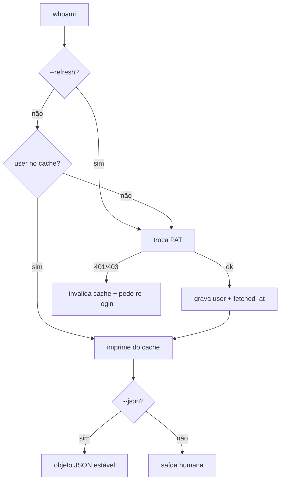

# Cache de identidade no login (whoami offline + --json)

## Problema
Toda vez que uma ferramenta precisa saber quem está logado, paga um round-trip de rede: o
`login` recebe os dados do usuário na troca do PAT e os descarta, e o `whoami` refaz a troca
só para imprimir um nome. Sem rede, não há identidade — mesmo já tendo autenticado.

## Solução
O `login` guarda os dados do usuário junto do PAT; o `whoami` responde na hora, do cache, e
oferece saída em JSON para outras ferramentas (como o noclaf Studio) consumirem sem chamar a
API do NOS nem refazer a troca a cada abertura.

## Histórias de usuário
1. Como usuário do CLI, quero `whoami` instantâneo, para não esperar rede só para ver minha conta.
2. Como usuário offline, quero ver quem está logado, para confirmar a identidade sem conexão.
3. Como ferramenta externa (Studio), quero a identidade em JSON estável, para renderizar a conta sem falar com a API do NOS.
4. Como usuário, quero forçar uma atualização, para refletir mudanças de perfil quando eu quiser.
5. Como usuário do Cowork/Desktop Extension (PAT via `NOCLAF_PAT`, sem `login`), quero que a identidade funcione mesmo sem cache prévio, para o fluxo não quebrar no meu ambiente.

## Escopo
Persistir os dados do usuário na credencial local no `login`, e evoluir o `whoami` para ler
do cache com saída humana e `--json`, com `--refresh` forçando nova troca. Tratar o caso do
PAT vindo por ambiente sem cache.

### Fora de escopo
- Renovação/rotação de PAT e expiração de sessão — fora deste recorte.
- Qualquer UI — o consumidor (Studio) tem spec própria.
- Novos campos de perfil além dos já retornados pela troca do PAT (`id`, `email`, `full_name`, `username`).
- Sincronização proativa em background do cache.

## Restrições
- A credencial continua com permissão restrita (`chmod 600`); o cache não afrouxa isso.
- Precedência de ambiente preservada: `NOCLAF_PAT` continua vencendo o arquivo.
- A troca do PAT segue sendo a única autoridade — o cache é conveniência, nunca fonte de verdade para autorização.
- Compatibilidade retroativa: uma credencial antiga (só `{ pat }`) precisa continuar válida.

## Questões em aberto
<!-- Todas resolvidas em 2026-07-22 — ver Registro de decisões. -->
-

## Decisões de implementação
- **Shape da credencial.** `Credentials` passa de `{ pat }` para `{ pat, user?, fetched_at? }`. `user` é o objeto retornado pela troca (`id`, `email`, `full_name`, `username`); `fetched_at` é ISO-8601 do momento do cache. Campos opcionais para não invalidar credenciais antigas.
- **`login` popula o cache.** Após a troca bem-sucedida, `saveCredentials` grava `pat` + `user` + `fetched_at`. Sem mudança no fluxo visível do `login`.
- **`whoami` lê do cache.** Ordem: se há `user` cacheado, imprime dele; senão faz a troca uma vez e popula. Ganha `--json` (saída estável e parseável) e `--refresh` (ignora o cache, refaz a troca, regrava).
- **Caso `NOCLAF_PAT` sem cache.** Quando o PAT vem do ambiente (Cowork/Extension) e não há `user` no arquivo, `whoami` faz a troca uma vez e — se houver arquivo de credencial gravável — popula; se o ambiente for read-only, responde sem persistir.
- **Invalidação.** Um 401/403 na troca (ex.: com `--refresh`) invalida o cache: limpa `user`/`fetched_at` e sinaliza reautenticação.
- **Contrato do `--json`.** Objeto com `id`, `email`, `full_name`, `username` e `fetched_at`. Chaves estáveis — é a interface que o Studio consome.

### Fluxo (Mermaid)

## Decisões de teste
- Testar **comportamento externo**: `login` deixa `user` no arquivo; `whoami` sem rede imprime do cache; `whoami --json` emite o contrato de chaves esperado; `--refresh` refaz a troca e regrava; credencial legada só-`pat` não quebra; `NOCLAF_PAT` sem cache faz uma troca e popula quando gravável.
- Mockar a troca do PAT (sem rede real nos testes). Não testar formatação humana caractere a caractere.
- Prior art: os testes de config/credenciais já existentes no repo.

## Tarefas
- [x] T1 · Estender `Credentials` para `{ pat, user?, fetched_at? }` com parse retrocompatível.
- [x] T2 · `login` grava `user` + `fetched_at` após a troca.
- [x] T3 · `whoami` lê do cache; adicionar `--json` (contrato estável) e `--refresh`.
- [x] T4 · Caso `NOCLAF_PAT` sem cache: troca única + população quando gravável; invalidação em 401/403.
- [x] T5 · Testes cobrindo cache, `--json`, `--refresh`, credencial legada e caso de ambiente.

## Critérios de aceitação
- [x] (T2) Dado um `login` bem-sucedido, quando inspeciono `credentials.json`, então há `pat`, `user` e `fetched_at`. — verificado por inspeção (o `login` chama `saveCredentials` com os três campos); o comando em si precisa de rede + prompt, então não tem teste automatizado.
- [x] (T3) Dado um usuário cacheado e sem rede, quando rodo `whoami`, então vejo a conta sem erro de rede.
- [x] (T3) Dado o cache, quando rodo `whoami --json`, então recebo um objeto com `id`, `email`, `full_name`, `username`, `fetched_at`.
- [x] (T3) Dado o cache, quando rodo `whoami --refresh`, então a troca é refeita e o arquivo é regravado.
- [x] (T1) Dada uma credencial antiga só com `pat`, quando uso qualquer comando, então nada quebra e `whoami` popula o cache na primeira troca.
- [x] (T4) Dado `NOCLAF_PAT` no ambiente sem cache, quando rodo `whoami`, então a identidade resolve com uma troca; e um 401/403 invalida o cache e pede re-login.

## Registro de decisões
- 2026-07-22: Cachear o usuário no `login` em vez de descartá-lo, e servir `whoami` do cache. Motivo: `whoami` instantâneo/offline e consumo por ferramentas sem round-trip. Origem: dependência da spec 0003 (UI) do noclaf-studio.
- 2026-07-22: `--json` com contrato de chaves estável é a interface pública para o Studio; `--refresh` é a válvula de atualização manual.
- 2026-07-22: Campos de cache **opcionais** para preservar credenciais legadas só-`pat`.
- 2026-07-22: `NOCLAF_PAT` reaproveita o cache do arquivo **só quando o PAT bate**. Motivo: um PAT de ambiente diferente do gravado serviria a identidade errada.
- 2026-07-22: A persistência do cache só toca um `credentials.json` **já existente** — `NOCLAF_PAT` num ambiente sem arquivo resolve sem criar credencial. Escrita falha em silêncio (read-only): cache é conveniência.
- 2026-07-22: `exchangePatForJwt` passou a anexar `status` no erro, para distinguir 401/403 (invalida cache + pede re-login) de falha de rede.

## Notas
Consumidor primário: a seção Conta do painel de configurações do noclaf-studio
([spec ui/0003](../../../../noclaf-studio/docs/specs/ui/0003-settings-panel.md), T7/T8).
