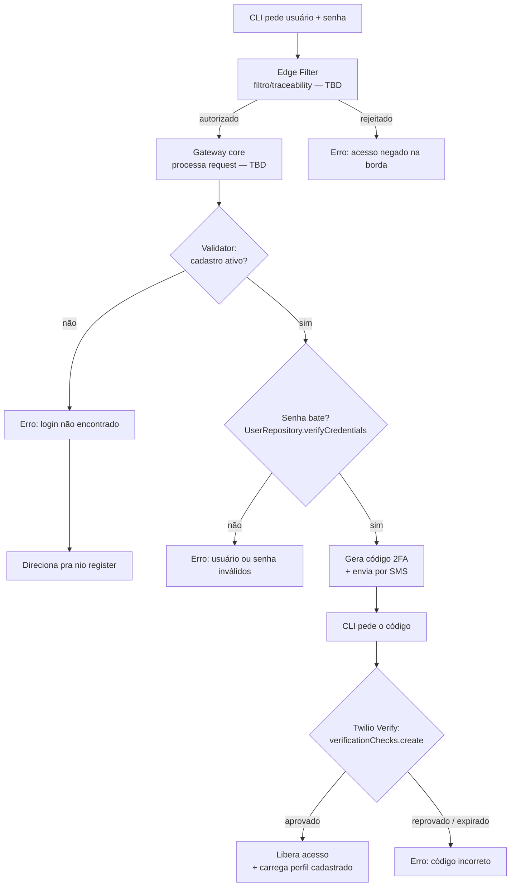

# Login v2 com 2º fator via SMS (Edge Filter → Gateway core → Validator)

> **Superada pela [spec 0004](./0004-login-2fa-sms-otp.md) (29 ago 2026, ADR
> 0006).** O canal (SMS) e as constraints NIST/ANPD desta spec seguem valendo e
> são citadas na 0004. O que mudou: **Twilio Verify → adapter HTTP genérico** e o
> **estado do OTP passa a ser nosso** (tabela `login_challenges`), já que sem
> Twilio a geração/TTL/tentativas do código não têm mais onde viver fora do repo.

## Problema
O `nio login` v2 (spec adjacente, já implementado — ver Notas) autentica com
usuário/senha direto contra `user_cli` via `UserRepository.verifyCredentials`,
num único fator, num único processo (a CLI fala com o Postgres sem
intermediário). Falta: (1) um segundo fator de prova de identidade, (2) uma
camada de borda que filtre/rastreie quem está entrando antes da credencial
chegar no banco, (3) um ponto único (Gateway core) que decida o que fazer com
a request depois de autenticada — hoje cada comando de CLI fala direto com o
repositório.

Esta spec nasce de uma sessão de mapeamento com o dono do produto (23 ago
2026) — o fluxo abaixo é o desenho inicial, **deliberadamente com peças
marcadas como "a definir"**. Não é uma spec fechada como a 0001; é o ponto de
partida pra desmembrar em tasks menores nas próximas sessões.

## Solução (desenho inicial)

Fluxo de login por usuário, em 9 estágios:

1. **CLI pede credenciais** — usuário + senha (mesma UI de hoje, `nio login`).
2. **Tunelamento pro Edge Filter** — a request sai da CLI e passa por uma
   camada de borda antes de qualquer processamento. Papel: identificar/
   filtrar quem está entrando. *(Parâmetros e critérios de filtro: a
   definir — ver Questões em aberto.)*
3. **Edge Filter → Gateway core** — depois de autorizada na borda, a request
   segue pro núcleo do Gateway.
4. **Gateway core processa a request** — decide o que fazer com base no tipo
   de request e permissionamento. *(Taxonomia de tipos de request e regras
   de permissão: a definir.)*
5. **Validator — usuário tem cadastro ativo?**
   - **Não** → erro "login não encontrado", direciona pro fluxo de cadastro
     (`nio register`, já existe).
   - **Sim** → segue pro passo 6.
6. **Confronto de credenciais** — a senha fornecida no passo 1 é validada
   contra o hash em `user_cli.password` (mecanismo já existe:
   `UserRepository.verifyCredentials` / argon2id).
   - Falha → erro (usuário ou senha inválidos).
   - Sucesso → segue pro 2º fator.
7. **Geração e envio do código (2º fator, SMS)** — via **Twilio Verify**
   (`verifications.create`) pro número cadastrado do usuário. O estado do
   código (geração, TTL, tentativas) vive do lado da Twilio — não
   guardamos/expiramos código nenhum no nosso banco.
8. **CLI pede o código** — usuário cola o que recebeu por SMS. Timeout local
   de referência: 30s (a validade real do código é controlada pela Twilio,
   configurável na API — confirmar o default antes de travar os 30s como
   prazo duro na UI).
9. **Validação do código** — via Twilio Verify (`verificationChecks.create`).
   - Aprovado → libera acesso, carrega a config de perfil já cadastrada do
     usuário.
   - Reprovado/expirado → erro "código incorreto".

### Fluxo (Mermaid)

## O que já existe (reuso direto)

| Peça do fluxo | Já implementado em |
|---|---|
| Passo 1 (prompt) | `src/cli/commands/auth.ts` (`nio login`) |
| Passo 5/6 (validator + confronto de senha) | `UserRepository.findByName` / `verifyCredentials` (`src/adapters/pg/user-repository.ts`) — anti-enumeração já embutida (não distingue "não existe" de "senha errada" pro chamador) |
| Passo 5, ramo "sem cadastro" | `nio register` já existe e cria em `user_cli` |
| Coluna de banco pro 2º fator | `user_cli.auth_2 BOOLEAN DEFAULT FALSE` já existe em `db/schema.sql` — hoje sem nenhum código lendo/escrevendo nela |
| Geração/armazenamento/expiração do código SMS | **Twilio Verify** — não precisamos mais do padrão de `authorize-store.ts` (Map+TTL) pra isso; o estado do OTP não é nosso problema |
| `Edge Filter` (Cloudflare Worker) como conceito de borda | `workers/edge-filter/` já existe (da spec 0002) — hoje só repassa e loga (ip, user-agent, trace id); segue **escrito à mão** |
| Camada de JWT/ACL/rate-limit/balanceamento entre Edge Filter e Gateway core | **Nova — Kong Gateway OSS** (adotado, ver Registro de decisões; não existe deploy ainda) |
| `Gateway core` como processo separado | `src/gateway/server.ts` (Bun.serve, porta 8787) — hoje só serve as rotas OAuth/PKCE; vira ponto de partida pra processar a request já validada pelo Kong, **escrito à mão** (Keycloak descartado, ver Registro de decisões) |

## O que falta (gaps reais, não só "a definir depois")

- **Coluna de telefone.** `user_cli` não tem campo de número — sem ele não
  há pra onde mandar o SMS. Precisa de migration nova.
- **Conta Twilio Verify.** Credenciais (Account SID, Auth Token, Verify
  Service SID) — nova contratação, ainda não existe.
- **Rate limiting.** Nada impede hoje um script tentando login em loop, ou
  disparando reenvio de SMS repetidamente pro mesmo número (custo direto —
  cada envio é cobrado pela Twilio, então isso também é superfície de abuso
  financeiro, não só de segurança).
- **Correlação com a Twilio.** Guardar o `sid` da verificação em andamento
  (por tentativa de login, com TTL curto) pra saber qual `verificationCheck`
  corresponde a qual sessão — esse é o único estado "de código" que ainda
  fica do nosso lado.

## Questões em aberto
- Parâmetros/critérios do **Edge Filter** (agora escrito à mão, sem Kong) —
  o que ele de fato inspeciona pra autorizar ou não uma request antes dela
  chegar no Gateway core? (IP, user-agent, rate limit, allowlist?)
- Taxonomia de **tipos de request** e regras de **permissionamento** no
  Gateway core (agora escrito à mão, sem Keycloak) — o que varia por tipo, e
  como o permissionamento por perfil (`Profile`:
  `fullstack`/`analyst`/`scientist`/`dba`/`qa`/`bi`) entra aqui?
- **Onde mora o Gateway core em produção** — mesma dúvida que já travava a
  spec 0002 (T6, nunca resolvida): local-only, VPS, Fly, Railway, Cloudflare?
- **`auth_2` é opt-in ou obrigatório** — todo usuário passa pelo 2º fator,
  ou é uma flag por conta (a coluna já é `BOOLEAN`, sugerindo opt-in)? Tem
  peso maior agora: NIST exige oferecer alternativa ao SMS pra quem não
  quiser/puder usá-lo (ver Restrições).

## Restrições (herdadas do que já está decidido em specs anteriores + pesquisa de 23/ago)
- Nunca logar/persistir a senha em texto puro (já vale pro `UserRepository`).
- **Nunca logar/persistir o código OTP em texto pleno** — se vazar, esse
  dado por si só já aciona o dever de notificação de incidente da ANPD
  (Resolução CD/ANPD nº 15/2024, dados de sistema de autenticação estão
  explicitamente na lista).
- **SMS é fallback, não único caminho** — NIST SP 800-63B Rev. 4 (jul/2025)
  classifica PSTN/SMS como *Restricted Authenticator* (§3.1.3.3/§3.2.9): não
  proibido, mas exige oferecer alternativa a quem não pode/quer usar SMS, e
  avisar o usuário do risco (troca de SIM). Implicação de design: `auth_2`
  não deveria travar o usuário sem saída se o número não estiver acessível.
- **Manter trilha auditável de tentativas de login** (quem/quando/resultado)
  desde já — a ANPD exige, em caso de incidente, descrever escopo e
  cronologia; reconstruir isso sem log não é viável depois do fato.
- Código de autorização/verificação é sempre **uso único** — princípio que
  já valia no fluxo PKCE da spec 0002 e continua valendo (a Twilio Verify já
  aplica isso do lado dela).
- `stdout` reservado pro JSON-RPC do MCP quando aplicável — logs em stderr.

## Registro de decisões
- 2026-08-23: Este fluxo (senha + SMS, atrás de Edge Filter/Gateway core)
  **substitui** o Gateway OAuth2/PKCE self-asserted da spec 0002 — não
  coexistem. Motivo: a 0002 nunca verificou credencial nenhuma (email livre,
  sem senha) e nunca foi plugada em `nio login`; o dono do produto decidiu
  que o login real da CLI vai por senha+SMS, não por confirmação no
  navegador. A 0002 foi marcada `status: superseded`. Código de
  `src/gateway/` não é apagado nesta decisão — fica candidato a reuso
  (padrão de code store com TTL, traceability) até o Gateway core desta spec
  ter forma concreta o suficiente pra decidir o que aproveitar.
- 2026-08-23: Avaliado adotar **Kong Gateway + Keycloak** como
  infraestrutura padrão de mercado pro Edge Filter/Gateway core, em vez de
  escrever à mão. **Decisão: não adotar nenhum dos dois.** Motivos, por
  pesquisa nas docs oficiais (RFC 9700/8628, docs Kong/Keycloak/Twilio, NIST
  SP 800-63B, ANPD):
  - **Kong**: rate limiting e validação de JWT são OSS, mas o plugin que
    resolveria o problema de verdade (OpenID Connect) é Enterprise/Konnect,
    pago. Pra 1 CLI + 1 MCP server, vira hop de rede e processo a mais sem
    entregar a peça que interessaria.
  - **Keycloak**: federar contra `user_cli` sem migrar dado é possível via
    User Storage SPI, mas o SPI é Java — stack diferente do resto do
    projeto. SMS não é nativo (precisaria de outro Authenticator SPI Java
    chamando a Twilio). Ou seja, adotar Keycloak = manter dois plugins Java
    só pra reproduzir o que o TypeScript+Postgres+argon2id já faz.
  - O PKCE já implementado na spec 0002 foi confirmado **já alinhado** com
    RFC 9700 (redirect URI exato com a exceção de porta em loopback, PKCE
    S256 obrigatório) — as únicas lacunas (proteção contra mix-up attack,
    sender-constraining de refresh token) só importam se um dia existir mais
    de um Authorization Server, o que não é o caso hoje.
  - RFC 8628 (Device Flow) foi descartado como alternativa ao PKCE+loopback
    já implementado — é desenhado pra dispositivo *sem* browser (smart TV,
    console); pra CLI com browser disponível na máquina, RFC 8252 já
    recomenda o padrão que a spec 0002 implementou.
  - **Única peça externa adotada: Twilio Verify**, pra SMS/OTP — elimina a
    gestão própria de estado de código (geração, TTL, tentativas) por um
    custo estimado de ~US$0,11/login com SMS (Verify + SMS Brasil). É a
    exceção que se paga sozinha; Kong/Keycloak não se pagavam.
  - Resto do fluxo (Edge Filter, Gateway core, permissionamento) segue
    **desenvolvimento manual**, usando RFC 9700/8252 como checklist de
    correção e as restrições de NIST/ANPD (acima) como guia de schema e
    logging desde o início, não como retrofit depois.
- **2026-08-23 (revisão do mesmo dia):** a rejeição do Kong acima estava
  escopada errado. O dono do produto esclareceu: o Kong **não** entraria no
  papel de handshake de credencial (isso segue 100% manual — Edge
  Filter/Gateway core/Validator/Twilio Verify, sem mudança) nem como AI
  Gateway pra tráfego de LLM (avaliado à parte — a NIO-CLI não faz chamada
  HTTP direta a provedor de LLM nenhum, `nio exec`/`nio plan` delegam pra
  binários locais já autenticados via `spawn`, então não há tráfego pra um
  AI Gateway interceptar). O papel real proposto é **downstream** do Edge
  Filter: validar o JWT que o próprio Gateway core emite, aplicar
  permissionamento por `Profile` (ACL), rate limiting e — se um dia houver
  mais de uma instância do Gateway core — balanceamento entre elas.
  Conferido plugin a plugin na doc oficial: `jwt`, `acl`, `rate-limiting`
  (básico), `request-validator` e balanceamento entre upstreams são **Kong
  Gateway OSS**, sem paywall — diferente do plugin `openid-connect`
  (Enterprise/Konnect), que é o que motivou a rejeição original e **não é
  necessário** pra este papel, já que a federação com IdP externo não faz
  parte do desenho. **Decisão revista: Kong Gateway OSS (idealmente em modo
  DB-less pra não somar mais um banco pra manter) é adotado como a camada
  entre o Edge Filter e o Gateway core.** Ressalva técnica: o `jwt` do Kong
  OSS valida contra credencial cadastrada por Consumer dentro do próprio
  Kong (sem JWKS/descoberta automática) — a chave de assinatura precisa ser
  provisionada/rotacionada como parte do fluxo, não é automático. Ver
  `docs/v2/ARQUITETURA-GATEWAY.md` pro desenho consolidado.

## Notas
Este documento é o ponto de partida, não o desenho final — a instrução
explícita foi "vamos evoluí-lo e desmembrá-lo em mais camadas". Com o
provedor de SMS resolvido (Twilio Verify) e Kong/Keycloak descartados, as
Questões em aberto que restam (parâmetros do Edge Filter, taxonomia do
Gateway core, hospedagem, `auth_2` opt-in) são as que bloqueiam a
implementação de fato — próximo passo natural é fechá-las e então quebrar em
tasks (`Tarefas`) com critérios de aceitação, no mesmo formato das specs
0001/0002.

Ver também `docs/v2/PROGRESSO.md` (2026-08-23) pro estado do login v2 sem
2º fator, que já funciona ponta a ponta hoje.
