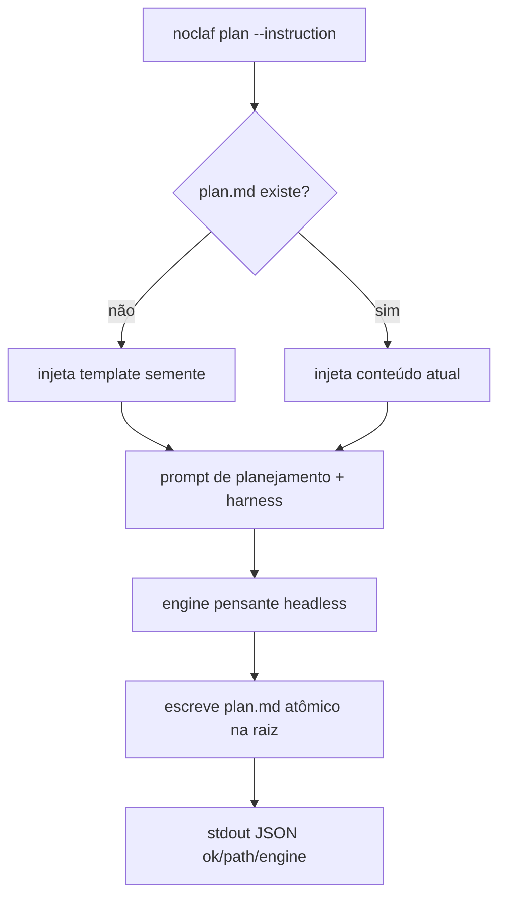

# Plan command — draft/refine plan.md with a thinking engine

## Problema
O `noclaf` só sabe **executar**: `noclaf exec` roda um agente num worktree, mexe em código e
mede o resultado. Não existe um verbo para a fase **anterior** — pensar o que fazer antes de
implementar. O noclaf Studio quer um "plano vivo" estilo Lovable (um `plan.md` na raiz que
evolui a cada prompt) como degrau pré-SDD, mas não tem a quem pedir isso: `exec` implementaria
código em vez de rascunhar um plano. Falta o motor do planejamento.

## Solução
Um verbo novo, `noclaf plan`, que roda o **engine pensante** sobre a raiz do projeto e escreve
um `plan.md` de rascunho pré-SDD. Se o arquivo não existe, **semeia** a partir de um template
com as seções do nosso SDD em rascunho; se existe, manda o engine **refinar** o texto atual à
luz da nova instrução. Não cria worktree, não mexe em código, não roda checks — a saída é um
markdown na raiz, não um diff. Mesmo contrato do `exec`: **stdout = JSON**, **stderr = log ao
vivo**, **exit ≠ 0 = falha**. Reusa o registro de engines da spec 0002 para escolher quem pensa.

## Histórias de usuário
1. Como caller (Studio ou humano), quero rodar `noclaf plan "<ideia>"` e receber um `plan.md` na raiz, para pensar antes de implementar.
2. Como caller, quero que um `plan.md` já existente seja **refinado**, não sobrescrito do zero, para o plano acumular raciocínio a cada rodada.
3. Como caller sem `plan.md`, quero que a primeira rodada **semeie** a estrutura pré-SDD, para não começar de uma folha em branco.
4. Como caller, quero escolher o engine (default o pensante), para planejar com um modelo mais forte do que o executor.
5. Como caller MCP/Studio, quero o mesmo verbo pela superfície headless, para a aba Plano consumir isto sem inventar formato.

## Escopo
O verbo `plan` na camada headless: ler o `plan.md` atual (ou o template semente) como contexto,
rodar o engine pensante com um prompt orientado a planejamento, **escrever** `plan.md` na raiz
do projeto e devolver o resultado no contrato JSON. Seleção de engine reaproveitando o registro
da 0002, com **default no engine pensante**.

### Fora de escopo
- Implementar código, criar worktree ou rodar checks — isso é o `exec`; `plan` nunca toca código.
- Graduar o `plan.md` para SDD (`/to-docs`/specs/tickets) — é outra etapa, disparada por quem quiser.
- Definir/gerir o template semente como arquivo editável pelo usuário — v1 usa um template embutido; externalizar é outra spec.
- Qualquer UI. A aba Plano do Studio consome este verbo numa spec própria lá (0005).
- Roteamento automático plan↔exec — quem escolhe o verbo é o caller.

## Restrições
- Segue o harness (`docs/_rules/noclaf.md`): arquivo < 300 linhas, função < 30 linhas, comentário ≤ 1 linha.
- **Contrato idêntico ao `exec`:** stdout = JSON do resultado, stderr = log ao vivo, exit ≠ 0 = falha. O caller nunca parseia o stderr para decidir estado.
- O engine roda **na assinatura** do provedor (sem API), como o `exec`/`runPatternsAnalysis` já fazem.
- Nunca destruir trabalho: refinar um `plan.md` existente parte do conteúdo atual; nunca zera um plano já escrito por erro.
- Reusa o **registro de engines da 0002** — nada de resolver binário/flags fora dele. `plan` só acrescenta o default pensante.
- O prompt de planejamento ancora em AGENTS.md + `docs/_rules/noclaf.md` (mesmo preâmbulo de harness do `exec`), mas manda **rascunhar um plano**, não codar.

## Questões em aberto
<!-- vazio -->

## Decisões de implementação
- **Verbo dedicado:** `noclaf plan --instruction <texto> [--project <path>] [--engine <codex|claude>]`. Sem `--worktree` (não se aplica) e sem a fase de checks do `exec`.
- **Semente vs refino:** se `<project>/plan.md` não existe, o comando injeta um **template embutido** (seções SDD-rascunho: Contexto, Problema, Solução, Escopo, Decisões, Tarefas) como base; se existe, injeta o conteúdo atual. Em ambos os casos o engine recebe a instrução e devolve o `plan.md` completo revisado.
- **Default no engine pensante:** `plan` tem seu próprio default (o engine mais forte, hoje `claude`), separado do default do `exec` (`codex`) — planejar quer raciocínio, executar quer velocidade. Ambos sobrescrevíveis por `--engine` e pela mesma env da 0002.
- **Prompt de planejamento:** um preâmbulo que ancora no harness (AGENTS.md + rules) e instrui explicitamente: rascunhe/refine o plano, **não escreva código**, devolva o markdown final do `plan.md`. Distinto do `buildPrompt` do `exec`.
- **Escrita atômica:** o comando escreve o `plan.md` resultante na raiz (write-then-rename), preservando o anterior até a escrita concluir.
- **Contrato de saída:** stdout = JSON `{ ok, path, engine }` (caminho do `plan.md` escrito e engine usado); stderr = log do engine ao vivo; engine ausente/não logado → falha com mensagem por engine (reaproveita `engineMissingError` da 0002).
- **MCP:** uma tool `noclaf_plan` espelha o verbo (project + instruction + engine opcional), para o Cowork/Studio delegarem planejamento como já delegam execução.

### Fluxo (Mermaid)


## Decisões de teste
- Prior art: funções puras testadas isoladas (como no resto do CLI).
- Alvos: a **escolha semente-vs-refino** (arquivo ausente → template; presente → conteúdo atual), a **montagem do prompt de planejamento** (ancora no harness, proíbe código) e a **normalização/validação do `--engine`** com o default pensante.
- O spawn real do engine e a escrita em disco **não** entram em teste unitário — verificação manual pelos critérios.

## Tarefas
- [x] T1 · Template semente embutido (seções SDD-rascunho) e a função que decide semente vs conteúdo atual.
- [x] T2 · Prompt de planejamento ancorado no harness (rascunha/refina, proíbe código), distinto do `buildPrompt` do exec.
- [x] T3 · `runPlan` reusando o registro/resolvedor de engines da 0002, com **default pensante**; escrita atômica do `plan.md`.
- [x] T4 · `noclaf plan --instruction [--project] [--engine]` no contrato stdout-JSON/stderr-log, com validação do engine.
- [x] T5 · Tool MCP `noclaf_plan` espelhando o verbo (project + instruction + engine opcional).
- [x] T6 · Erro por engine ausente/não logado reaproveitando `engineMissingError`.

## Critérios de aceitação
- [x] (T1, T4) Dado um projeto **sem** `plan.md`, quando rodo `noclaf plan "<ideia>"`, então um `plan.md` é criado na raiz a partir do template semente, preenchido pela ideia.
- [x] (T1, T3, T4) Dado um projeto **com** `plan.md`, quando rodo `noclaf plan "<ajuste>"`, então o arquivo é refinado a partir do conteúdo atual — o raciocínio anterior não some.
- [x] (T3, T4) Dado nenhum `--engine`, quando rodo `noclaf plan`, então usa o engine **pensante** (não o codex do exec).
- [x] (T4) Dado `--engine <inválido>`, quando rodo, então recebo erro listando os suportados, sem rodar nada.
- [x] (T2) Dado qualquer rodada de plan, quando inspeciono o comando, então o engine é instruído a **não escrever código** e a devolver o markdown do plano.
- [x] (T4) Dado sucesso, quando leio o stdout, então é JSON com `ok`, `path` do `plan.md` e `engine` usado; o stderr trouxe o log ao vivo.
- [x] (T6) Dado o engine escolhido ausente/não logado, quando rodo, então falha com mensagem dizendo o que instalar/configurar. *(caminho compartilhado com a 0002; `engineMissingError` reusado — não reproduzido com o binário de fato ausente.)*
- [x] (T5) Dado a tool `noclaf_plan` com `engine`, quando o Studio a chama, então planeja com a mesma escolha do CLI. *(mesma `runPlan`; verificado por registro da tool, não por chamada MCP ao vivo.)*

## Registro de decisões
- 2026-07-23: `plan` é **verbo próprio**, não `exec --mode plan` — planejar e executar têm responsabilidades opostas (um não toca código, o outro é só código); separar mantém cada comando pequeno e o contrato limpo. (Decisão do usuário no design da aba Plano.)
- 2026-07-23: default do `plan` é o **engine pensante** (`claude`), separado do default do `exec` (`codex`) — planejar pede raciocínio; a spec 0002 já deixou o registro pronto pra ter defaults por verbo.
- 2026-07-23: semente por **template embutido** (não folha em branco nem arquivo externo) — dá estrutura SDD-rascunho desde a primeira rodada sem inventar um formato de config agora.
- 2026-07-23: refino parte do **conteúdo atual** do `plan.md` — o plano é acumulativo; reescrever do zero perderia o raciocínio já feito.
- 2026-07-23: default por verbo virou `parseEngine(value, fallback)` no registro da 0002, em vez de uma segunda constante resolvida em cada caller — o registro segue sendo o único lugar que conhece engine, e `exec`/`plan` só passam o seu fallback.
- 2026-07-23: o markdown do plano é o **stdout** do engine e o log ao vivo é o **stderr** dele — diferente do `exec`, que junta os dois no `summary`. Aqui a saída do engine *é* o artefato, então os canais não podem se misturar; `stripFence` remove a cerca ```` ```markdown ```` que o engine às vezes adiciona.
- 2026-07-23: `plan.md` existente porém **vazio** cai no template semente — um arquivo em branco não é raciocínio a preservar.

## Notas
Esta spec **destrava** a aba Plano do noclaf Studio (spec 0005 lá): assim que `noclaf plan`
existir, o Studio ganha o editor+preview do `plan.md` e o toggle Plan|Build no Composer,
consumindo este verbo. A graduação `plan.md → SDD` (disparar `/to-docs`) é etapa posterior,
fora daqui.
