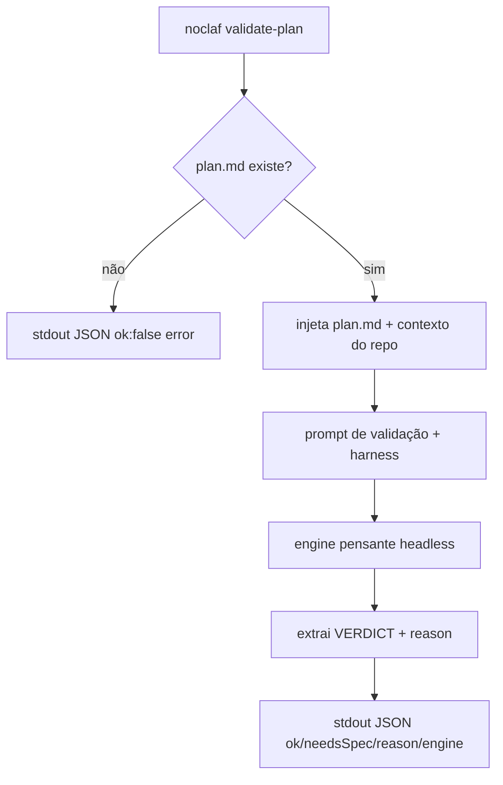

# Validate-plan — triage a plan's complexity into a spec/no-spec recommendation

## Problema
O `noclaf plan` produz um `plan.md`, e o Studio deixa o usuário **aceitar** esse plano. Mas na
hora de aceitar falta um julgamento: esse plano é simples o bastante pra ir direto pro código,
ou é complexo/abrangente a ponto de merecer virar uma spec SDD antes? Hoje só a pessoa decide,
no olho — sem uma leitura do plano contra o que ele realmente mexeria no código. Falta um agente
que faça essa triagem e devolva uma recomendação clara.

## Solução
Um verbo novo, `noclaf validate-plan`, que **lê o `plan.md`** (o que o `noclaf plan` escreveu) e
**o repositório**, roda o engine pensante para julgar a complexidade do plano frente ao impacto
no código, e devolve um **sim/não** simples: **sim** = o plano é complexo o bastante para exigir
uma spec antes de implementar; **não** = pode ir direto pra implementação. Junto vem um `reason`
— um texto curto e legível ("bonitinho") explicando o porquê, que o Studio mostra no prompt de
aceite como recomendação. É triagem, não geração: não escreve spec nem código. Mesmo contrato do
`plan`/`exec`: **stdout = JSON**, **stderr = log**, **exit ≠ 0 = falha**.

## Histórias de usuário
1. Como caller (Studio ou humano), quero validar um `plan.md` e receber sim/não sobre precisar de spec, para decidir o próximo passo com base num julgamento, não no chute.
2. Como caller, quero um `reason` legível junto do sim/não, para mostrar ao usuário por que a recomendação é essa.
3. Como caller, quero que a triagem leia o **plano e o código**, para o julgamento refletir o impacto real, não só o texto.
4. Como caller, quero escolher o engine (default o pensante), para triagem usar um modelo de julgamento.
5. Como caller MCP/Studio, quero o mesmo verbo pela superfície headless, para o diálogo de aceite consumir isto sem inventar formato.

## Escopo
O verbo `validate-plan` na camada headless: ler o `plan.md` da raiz (falha clara se não houver),
dar ao engine pensante contexto do plano + do repositório, e devolver `{ needsSpec, reason }` no
contrato JSON. Seleção de engine reaproveitando o registro da 0002, com **default no engine
pensante** (mesmo do `plan`).

### Fora de escopo
- Gerar a spec/tickets — a graduação é um `noclaf exec` rodando o `/to-docs`; `validate-plan` só recomenda.
- Implementar código ou criar worktree — não é o papel deste verbo.
- Decidir sobre worktree — o sim/não é **spec-ou-não**; a escolha de worktree segue no controle do caller (Studio).
- Tornar a recomendação vinculante — o caller (usuário) confirma ou sobrepõe; `validate-plan` sugere.
- Qualquer UI. O diálogo de aceite do Studio consome este verbo numa spec própria lá.

## Restrições
- Segue o harness (`docs/_rules/noclaf.md`): arquivo < 300 linhas, função < 30 linhas, comentário ≤ 1 linha.
- **Contrato idêntico ao `plan`/`exec`:** stdout = JSON, stderr = log ao vivo, exit ≠ 0 = falha. O caller nunca parseia o stderr para decidir.
- O engine roda **na assinatura** do provedor (sem API), como o `plan`/`exec`/`runPatternsAnalysis` já fazem.
- Reusa o **registro de engines da 0002** — nada de resolver binário/flags fora dele. `validate-plan` usa o **default pensante** (igual ao `plan`).
- Depende de um `plan.md` existente: sem ele, falha com mensagem clara (não inventa plano).
- A saída é **determinística no formato** mesmo que o julgamento seja do modelo: `needsSpec` é booleano; `reason` é texto curto de uma frase ou duas.

## Questões em aberto
<!-- vazio -->

## Decisões de implementação
- **Verbo dedicado:** `noclaf validate-plan [--project <path>] [--engine <codex|claude>]`. Sem `--instruction` (o insumo é o `plan.md`) e sem `--worktree`.
- **Insumo = `plan.md` + repo:** o comando lê o `plan.md` da raiz e roda o engine no diretório do projeto, para o julgamento considerar o código real que o plano tocaria. `plan.md` ausente → falha clara.
- **Prompt de validação:** um preâmbulo que ancora no harness e instrui o engine a **julgar complexidade vs. impacto no código** e responder **apenas** num formato parseável — o veredito (needsSpec) e uma justificativa curta. Distinto do prompt do `plan` (que rascunha) e do `exec` (que implementa).
- **Extração do veredito:** o engine responde num marcador previsível (ex.: uma linha `VERDICT: yes|no` + o resto como `reason`), e o comando normaliza isso para `{ needsSpec: boolean, reason: string }`. Resposta ambígua → erro tratado, não um chute silencioso.
- **Default no engine pensante:** mesmo default do `plan` (o mais forte, hoje `claude`) — é julgamento, não velocidade. Sobrescrevível por `--engine` e pela env da 0002.
- **Contrato de saída:** stdout = JSON `{ ok, needsSpec, reason, suggestedSlug?, engine }`; stderr = log do engine ao vivo; engine ausente/não logado → falha com mensagem por engine (reaproveita `engineMissingError` da 0002); `plan.md` ausente → `{ ok: false, error }`.
- **Slug sugerido:** quando `needsSpec === true`, o comando deriva um `suggestedSlug` git-safe do título/feature do `plan.md` (função pura, kebab-case, `[a-z0-9-]`, hífens colapsados, teto ~50 chars, degenerado → fallback), para o Studio nomear o worktree onde vai rodar o `/to-docs`. É **sugestão**: o Studio trata colisão (reusa ou escolhe outro) — o CLI não toca o disco nem cria worktree. `needsSpec === false` → campo omitido.
- **MCP:** uma tool `noclaf_validate_plan` espelha o verbo (project + engine opcional), para o Cowork/Studio consumirem a triagem como consomem plan/exec.

### Fluxo (Mermaid)

## Decisões de teste
- Prior art: funções puras testadas isoladas (como no resto do CLI).
- Alvos: a **extração/normalização do veredito** (yes→true, no→false, ambíguo→erro), a **montagem do prompt de validação** (ancora no harness, pede formato parseável) e a **validação do `--engine`** com o default pensante.
- O spawn real do engine **não** entra em teste unitário — verificação manual pelos critérios.

## Tarefas
- [x] T1 · Leitura do `plan.md` da raiz + montagem do contexto (plano + repo); falha clara se ausente.
- [x] T2 · Prompt de validação ancorado no harness, pedindo veredito + justificativa em formato parseável.
- [x] T3 · Extração/normalização do veredito para `{ needsSpec, reason }`; ambíguo → erro tratado.
- [x] T4 · `runValidatePlan` reusando o registro/resolvedor de engines da 0002, com default pensante.
- [x] T5 · `noclaf validate-plan [--project] [--engine]` no contrato stdout-JSON/stderr-log, com validação do engine.
- [x] T6 · Tool MCP `noclaf_validate_plan` espelhando o verbo (project + engine opcional).
- [x] T7 · Erro por engine ausente/não logado reaproveitando `engineMissingError`; erro por `plan.md` ausente.

## Critérios de aceitação
- [x] (T1, T5) Dado um projeto **sem** `plan.md`, quando rodo `noclaf validate-plan`, então recebo `{ ok: false, error }` dizendo que falta o plano — sem rodar o engine.
- [x] (T2, T3, T5) Dado um `plan.md` de mudança ampla/complexa, quando rodo, então `needsSpec` é `true` e vem um `reason` legível explicando o porquê.
- [x] (T2, T3, T5) Dado um `plan.md` de mudança pequena/localizada, quando rodo, então `needsSpec` é `false` e o `reason` justifica ir direto.
- [x] (T3) Dado um veredito ambíguo do engine, quando normalizo, então vira erro tratado, não um `needsSpec` chutado.
- [x] (T4, T5) Dado nenhum `--engine`, quando rodo, então usa o engine **pensante** (mesmo default do `plan`).
- [x] (T5) Dado sucesso, quando leio o stdout, então é JSON com `ok`, `needsSpec`, `reason` e `engine`; o stderr trouxe o log.
- [x] (T7) Dado o engine escolhido ausente/não logado, quando rodo, então falha com mensagem dizendo o que instalar/configurar.
- [x] (T6) Dado a tool `noclaf_validate_plan`, quando o Studio a chama no aceite, então recebe o mesmo `{ needsSpec, reason }` do CLI.

## Registro de decisões
- 2026-07-23: verbo **`validate-plan`** (renomeado de "assess") — nomeia o que ele faz: valida o `plan.md` que o `noclaf plan` produziu. Fica claro que cobre a saída do `plan`.
- 2026-07-23: o veredito é **spec-ou-não**, não worktree — a escolha de worktree continua no controle do caller; misturar as duas decisões num só sim/não confundiria.
- 2026-07-23: recomendação **não vinculante** — o usuário confirma/sobrepõe no Studio; a triagem informa, não decide por ele.
- 2026-07-23: default pensante (igual ao `plan`) — triagem é julgamento; reusa o registro da 0002 que já suporta default por verbo.
- 2026-07-23: implementado — `validate-plan-delegate` reusa `planPath`/`stripFence` do `plan-delegate` e o registro de engines da 0002; veredito extraído por marcador `VERDICT: yes|no` + `REASON:`, com tolerância a cerca de código e reason inline; ambíguo/sem justificativa vira erro tratado. Spawn real do engine fica em verificação manual (não unitário), como o `plan`.
- 2026-07-23: `suggestedSlug` **nasce aqui** — o `validate-plan` já leu o plano, então é ele quem sugere o nome do worktree; o `/to-docs` roda **dentro** do worktree e não pode nomeá-lo. Consumido pela rota **"Criar spec"** da spec 0007 (Studio), que trata colisão. Emitido só quando `needsSpec`; derivação é função pura (`suggestSlug`) coberta por teste (título normal, acentos/símbolos, degenerado, corte de comprimento).

## Notas
`validate-plan` só **recomenda** — a geração não é um verbo próprio. No Studio, o diálogo de
aceite roda o `validate-plan` para pré-selecionar **"Criar spec"** (needsSpec) ou **"Implementar
direto"**; a escolha é do usuário. Se ele for por **spec**, o Studio dispara um `noclaf exec` com
uma instrução de graduação que roda o **`/to-docs`** (gera spec `draft` + tickets, com o scan de
id global do próprio skill); se for por **implementar direto**, dispara o `noclaf exec` que
implementa o plano. Essa fiação do diálogo e a navegação pós-aceite são spec própria do Studio,
dependente só deste verbo.
