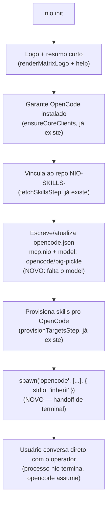

# Arquitetura do Cliente de IA Fixo (OpenCode / big-pickle)

> Documento de referência — consolida a decisão de 24 ago 2026 de fazer da
> NIO-CLI um produto **autocontido**: em vez de servir tools MCP pra
> assistentes externos que o usuário já tem (Claude Code, Codex, Cowork),
> `nio init` passa a **embutir** um operador de IA fixo (OpenCode rodando o
> modelo `big-pickle`) que conduz toda a interação.
>
> **Achado ao levantar este documento**: a base já existe. Uma decisão
> anterior, de **27 jul 2026**, já tinha restringido a superfície ativa a só
> OpenCode (`src/lib/targets.ts`: `ALL_TARGETS = [opencodeTarget]`;
> `ensureCoreClients` só checa OpenCode). O que é novo aqui é: travar o
> **modelo** (não só o cliente), fazer o `init` terminar **dentro** de uma
> sessão viva (não só configurar e devolver o prompt), e o repo de skills
> virar a base de conhecimento exclusiva desse operador.

## Resumo executivo

`nio init` passa a: mostrar o logo + um resumo do que a CLI faz → vincular
ao repo `NIO-SKILLS-` → garantir o `opencode.json` com o MCP da própria
`nio-cli` registrado e o modelo travado em `opencode/big-pickle` → **entregar
o terminal pro `opencode`**, já dentro da conversa. O usuário não volta pro
shell puro depois do `init` — ele já está falando com o operador.

Extensível no futuro pra mais modelos (dentro do mesmo operador OpenCode,
segundo o que foi dito) — não é uma reabertura da escolha de cliente externo.

## O que já existe (confirmado lendo o código, 24 ago 2026)

| Peça | Estado |
|---|---|
| `ALL_TARGETS = [opencodeTarget]` (`src/lib/targets.ts`) | ✅ Só OpenCode é alvo de provisionamento — decisão de 27 jul 2026 |
| `ensureCoreClients` (`src/cli/flows/clients.ts`) | ✅ Só checa/instala OpenCode |
| `promptClientChoices` (`clients-step.ts`) | ✅ Checkbox já só oferece "OpenCode (global)" |
| `installOpencodeGlobal()` (`src/lib/client-configs.ts`) | ✅ Escreve `~/.config/opencode/opencode.json` com `mcp.nio` apontando pro binário `nio-cli`, `NIO_CLIENT=opencode` |
| `opencodeTarget.mapDocs` | ✅ Reaproveita o layout cru do pacote de skills (mesmo formato do Claude Code, sem tradução) |
| Filtro de skill por `clients:` (`surface: 'opencode'`) | 🟡 O mecanismo existe, mas tem um bug (ver abaixo) |
| **Modelo travado em `opencode.json`** | ❌ Não existe — `installOpencodeGlobal()` não escreve a chave `model` |
| **`nio init` termina dentro de uma sessão viva do `opencode`** | ❌ Não existe — o wizard hoje termina em `offerFollowUps` e devolve o prompt do shell |
| **Logo + help antes de entrar na sessão** | 🟡 `renderMatrixLogo()` já existe e é usado em outros pontos (login, etc.) — só falta compor no fluxo do `init` |

## Bug real encontrado no caminho

`src/lib/skills.ts`:
```ts
export const KNOWN_CLIENTS = ['claude-code', 'codex', 'cowork'] as const;
```
Não inclui `'opencode'`. `parseClients()` filtra o campo `clients:` do
frontmatter por esse conjunto — então **um doc que declare `clients: opencode`
explicitamente no frontmatter é descartado silenciosamente** (cai fora do
conjunto reconhecido, vira lista vazia → tratado como `null`/todos, o que por
acaso não quebra nada hoje porque não há doc algum restrito só a `opencode`
ainda — mas é uma armadilha esperando alguém escrever `clients: opencode`
achando que vai funcionar). Corrigir é factual, não é opinião de arquitetura.

## Diagrama do novo fluxo do `nio init`



## Decisões e limitações reais (não maquiar)

**O modelo não é travado de verdade pelo OpenCode.** Pesquisei a config
oficial: `model` no `opencode.json` de projeto/global é só um **default** —
nada impede o usuário de trocar via `/models` ou flag depois de já estar na
sessão. Um lock de verdade existe (`managed settings`, em
`/Library/Application Support/opencode/` no mac ou `/etc/opencode/` no
Linux), mas isso exige escrita em diretório de sistema, tipicamente fora do
alcance de um `npm i -g` rodando como usuário comum — não é algo pra `nio
init` fazer silenciosamente sem uma instalação privilegiada separada.
**Decisão pra agora**: `nio init` escreve `model: "opencode/big-pickle"`
como default (soft) — é o que impede a fricção do dia a dia (ninguém
escolhe manualmente), mas não é uma garantia de segurança/produto. Se um
lock de verdade vier a ser necessário, é uma sub-tarefa separada e maior
(managed settings, possivelmente exige privilégio de admin no install).

**Onde o `model`/`mcp` são escritos**: hoje `installOpencodeGlobal()` escreve
em `~/.config/opencode/opencode.json` (**global**, por-máquina). O exemplo
que motivou esta conversa (`postgres-producao`, `powerbi-modeling-mcp`,
etc.) era um `opencode.json` de **projeto**, com `$schema`. Isso é uma
decisão a bater: continuar só global (mais simples, um `nio init` em
qualquer pasta usa a mesma config), ou passar a escrever também/só a nível
de projeto (permite variar MCPs por repo/perfil, mas complica a
precedência — projeto vence global no OpenCode, então um `opencode.json` de
projeto errado pode silenciosamente sobrescrever o `model` global).

**MCPs externos por perfil** (PowerBI, Postgres read-only, DAX, Pencil,
etc., do exemplo que motivou a conversa): fica de fora do escopo deste
documento de propósito — é a peça de "materialização do ambiente" (que
`Session`/`Profile`/`EnvironmentConfig` já modelam no schema, mas
`EnvironmentBuilder` ainda não existe em código nenhum). Fixar o operador
(OpenCode/big-pickle) é pré-requisito lógico disso, mas o mapeamento
perfil→MCPs é uma tarefa própria, maior, pra depois.

## O que fica órfão (candidato a limpeza, não decisão nova)

Como `ALL_TARGETS` já só tem `opencodeTarget` desde 27 jul, isto já era
verdade antes desta conversa — só reafirmando que segue valendo:

- `claudeTarget`, `codexTarget` (`src/lib/targets.ts`) — definidos, fora da
  lista ativa.
- `toCodexDocs`, `toCodexSkillContent`, `toCodexPromptContent`
  (`src/lib/client-configs.ts`) — só usados por `codexTarget`, que está fora
  de `ALL_TARGETS`.
- `installCodexGlobal` e equivalente do Claude, se existirem — mesma
  situação.
- O checkbox de `promptClientChoices` com uma única opção é, na prática,
  teatro de UI — perguntar algo que só tem uma resposta possível. Candidato
  a virar automático ("Configurando OpenCode automaticamente" em vez de um
  checkbox).

Nenhum desses é urgente — não atrapalham nada rodando. Ficam registrados
pra quando o segundo agente for limpar de vez (mesma lógica da
`TASK-remocao-v1.md`).

## Questões em aberto

- **Nome exato do binário/flags do `opencode` pra abrir já numa pasta/config
  específica** — confirmar `opencode [project]` (visto no `--help`) é
  suficiente, ou precisa de flag adicional pra garantir que ele carregue o
  `opencode.json` que acabamos de escrever.
- **O que exatamente o "help" mostra antes de entrar na sessão** — só o
  logo + uma frase, ou um resumo maior dos comandos que o operador vai
  poder rodar por trás?
- **Autenticação do `big-pickle`** — precisa de credencial própria do
  OpenCode Zen (`opencode auth`/`providers`)? Se sim, `nio init` precisa
  checar/orientar isso antes do handoff, senão o usuário cai numa sessão
  que não consegue nem chamar o modelo.
- **Global vs. projeto** para `model`/`mcp` no `opencode.json` (ver seção
  acima) — não decidido ainda.

## Referências

- `docs/v2/TASK-cliente-ia-fixo.md` — tarefas concretas pro segundo agente.
- `src/lib/targets.ts`, `src/lib/client-configs.ts`, `src/cli/commands/init/*` — código relevante hoje.
- `docs/v2/TASK-remocao-v1.md` — mesma convenção de tarefa incremental pro segundo agente, tema diferente (v1/Supabase).
