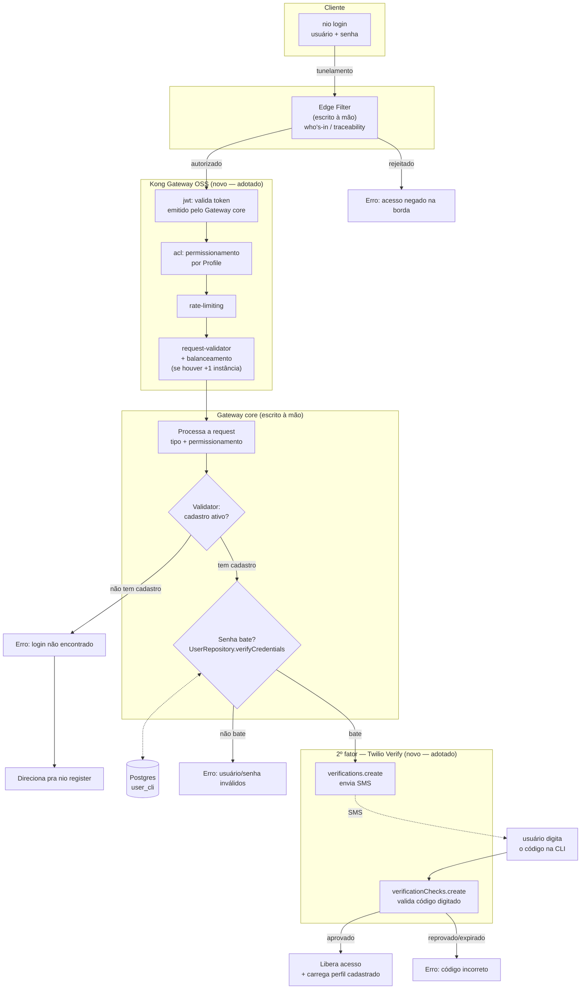

# Arquitetura do Gateway de Autenticação (v2)

> Documento de referência único — consolida as decisões espalhadas pelas
> specs `docs/specs/auth/0002-cli-native-login.md` (superseded) e
> `docs/specs/auth/0003-login-2fa-sms.md` (draft, em desmembramento), mais a
> pesquisa de RFCs/produtos feita em 23 ago 2026. Objetivo: qualquer pessoa
> (ou agente) que pegue este arquivo entende o desenho completo sem precisar
> reconstruir o histórico da conversa que o gerou.
>
> **Estado nesta data: arquitetura desenhada, nada da camada de Gateway
> implementado ainda.** O que já funciona ponta a ponta hoje é só o 1º fator
> (usuário/senha direto contra `user_cli`, sem Edge Filter, sem Kong, sem
> Gateway core, sem 2º fator) — ver `docs/v2/PROGRESSO.md` (23 ago 2026).

## Resumo executivo

O login real da CLI vai ter dois fatores — senha (já existe) + código SMS
(a construir) — atrás de um pipeline de três camadas: uma borda escrita à
mão (Edge Filter), um Kong Gateway OSS fazendo validação/permissionamento/
rate-limit/balanceamento, e um núcleo escrito à mão (Gateway core) que
processa a request já autenticada e chama o Validator (que já existe,
reaproveitado de ontem). SMS é terceirizado pra Twilio Verify. Nenhum IdP
externo (Keycloak) nem AI Gateway (Kong AI Gateway) entram no desenho —
ambos avaliados e descartados, com motivo documentado abaixo.

## Diagrama da arquitetura completa

## Camada por camada

| Camada | Quem faz | Papel | Status |
|---|---|---|---|
| **CLI** | Código próprio | Pede usuário/senha, depois o código SMS | ✅ Parte 1 (senha) já existe e funciona (`src/cli/commands/auth.ts`) |
| **Tunelamento** | Código próprio | Transporte da request da CLI até a borda | ❌ Não existe — a CLI hoje fala direto com o Postgres, sem rede intermediária nenhuma |
| **Edge Filter** | Escrito à mão (`workers/edge-filter/`, Cloudflare Worker já existe da spec 0002) | Primeira triagem de quem está entrando — hoje só loga (ip, user-agent, trace id) e repassa, não filtra nada de fato | 🟡 Scaffold existe, sem lógica de filtro real |
| **Kong Gateway OSS** | Ferramenta adotada (self-hosted, modo DB-less) | `jwt` (valida token emitido pelo Gateway core), `acl` (permissionamento por `Profile`), `rate-limiting`, `request-validator`, balanceamento entre instâncias do Gateway core se houver mais de uma | ❌ Não existe deploy nenhum ainda — decisão tomada, nada instalado |
| **Gateway core** | Escrito à mão (`src/gateway/server.ts` já existe da spec 0002, hoje só serve rotas OAuth/PKCE que não são mais o caminho) | Processa a request já validada pelo Kong; decide por tipo de request; orquestra Validator → confronto de senha → 2º fator | 🟡 Scaffold existe (Bun.serve na porta 8787), lógica de processamento não |
| **Validator** | Código próprio, já existe | Confere se o usuário tem cadastro ativo em `user_cli` | ✅ `UserRepository.findByName` |
| **Confronto de senha** | Código próprio, já existe | Verifica a senha contra o hash argon2id | ✅ `UserRepository.verifyCredentials` — anti-enumeração embutida |
| **2º fator (SMS)** | Ferramenta adotada — **Twilio Verify** | Gera, envia e valida o código OTP; guarda o estado do código do lado deles, não do nosso | ❌ Conta/credenciais Twilio ainda não existem |
| **Sessão local** | Código próprio, já existe | `~/.nio/session.json` + `user_cli.token_session` | ✅ `src/lib/session-store.ts` |

Legenda: ✅ implementado e testado · 🟡 scaffold/esqueleto existe, lógica principal falta · ❌ não existe nada ainda

## Stack — o que foi adotado e o que foi descartado

| Tecnologia | Decisão | Por quê |
|---|---|---|
| Postgres + argon2id + `UserRepository` | **Adotado** (já em produção) | 1º fator já funciona ponta a ponta, testado |
| **Twilio Verify** | **Adotado** | Elimina gestão própria de estado de OTP (geração/TTL/tentativas); ~US$0,11/login com SMS no Brasil; sem alternativa OSS que faça o envio de SMS de verdade (SMS em si nunca é grátis, é rede de telefonia) |
| **Kong Gateway OSS** (self-hosted, DB-less) | **Adotado** — só pra JWT/ACL/rate-limit/balanceamento **depois** do Edge Filter | Os plugins necessários (`jwt`, `acl`, `rate-limiting`, `request-validator`) e o balanceamento entre upstreams são núcleo OSS, sem paywall. Modo DB-less evita somar mais um banco pra operar |
| Kong `openid-connect` plugin / Kong Konnect | **Descartado** | Enterprise/pago — mas também **não é necessário**: o handshake de credencial (senha+SMS) é feito à mão, o Kong só valida o token que a gente mesmo emite |
| **Kong AI Gateway** (AI Proxy, Prompt Guard, etc.) | **Descartado — não se aplica** | É pra gatear chamadas HTTP diretas a provedores de LLM. A NIO-CLI não faz isso: `nio exec`/`nio plan` delegam via `spawn()` pra binários locais (`codex`, `claude`) já autenticados por conta própria — a chamada ao modelo acontece dentro desses processos, nunca passa pela NIO-CLI. Não há tráfego pra interceptar hoje. Reabrir se um dia a CLI passar a chamar API de LLM diretamente |
| **Keycloak** | **Descartado** | Federar contra `user_cli` sem migrar dado exige um User Storage SPI em **Java** (stack diferente do resto do projeto); SMS não é nativo, exigiria outro Authenticator SPI Java chamando a Twilio. Adotar = manter 2 plugins Java pra reproduzir o que o TypeScript já faz |
| RFC 8628 (Device Authorization Grant) | **Descartado como alternativa ao PKCE já implementado** | Desenhado pra dispositivo *sem* browser (smart TV, console). Pra CLI com browser disponível na máquina, RFC 8252 já recomenda Authorization Code+PKCE com redirect loopback — o que a spec 0002 implementou está certo |
| Gateway OAuth2/PKCE self-asserted (spec 0002) | **Superseded** | Nunca verificava senha nenhuma (email livre) e nunca foi plugado na CLI. Login real vai por senha+SMS, não por confirmação no navegador. Código não apagado — `authorize-store.ts`/`traceability.ts` são candidatos a reuso de padrão |

## Conformidade e segurança (checklist vivo)

**RFC 9700 (OAuth 2.0 Security BCP)** — o PKCE já implementado (S256, redirect
loopback exato, code de uso único com TTL) já está alinhado. Fica de olho
pra quando a arquitetura crescer:
- Proteção contra *mix-up attack* (RFC 9207) — só vira relevante se existir
  mais de um Authorization Server.
- Sender-constraining/rotação de refresh token — só relevante se refresh
  token for introduzido.

**NIST SP 800-63B Rev. 4 (jul/2025)** — SMS/PSTN é *Restricted Authenticator*
(§3.1.3.3/§3.2.9): não proibido, mas exige alternativa pra quem não pode/quer
usar SMS, e aviso do risco (troca de SIM). **Implicação de design**: `auth_2`
não pode travar o usuário sem saída se o número não estiver acessível —
precisa de um caminho alternativo (a definir, ver Questões em aberto).

**ANPD (Resolução CD/ANPD nº 15/2024)** — dados de sistema de autenticação
estão na lista que aciona dever de notificação de incidente (prazo de 3 dias
úteis a partir da ciência). Implicações concretas pro schema/logging, a
tratar desde a primeira migration, não depois:
- Nunca logar/persistir senha ou código OTP em texto pleno.
- Manter trilha auditável de tentativas de login (quem/quando/resultado).
- Política de retenção/minimização pra coluna de telefone (ainda não existe).

## O que falta construir (visão consolidada)

1. **Migration**: coluna de telefone em `user_cli`.
2. **Conta Twilio Verify**: Account SID, Auth Token, Verify Service SID.
3. **Edge Filter real**: hoje só loga; falta a lógica de filtro/autorização
   de fato (critérios ainda em aberto).
4. **Deploy do Kong** (DB-less, config declarativo) + provisionamento da
   credencial JWT que o Gateway core vai emitir.
5. **Gateway core**: lógica de processamento de request, taxonomia de tipos,
   permissionamento por `Profile` (o que o Kong `acl` vai aplicar em cima).
6. **Correlação de verificação Twilio**: guardar o `sid` da tentativa em
   andamento, TTL curto, pra casar o código digitado com a sessão de login
   certa.
7. **Rate limiting** (via Kong `rate-limiting`, mas a política em si —
   quantas tentativas, qual janela — ainda não foi definida).
8. **Caminho alternativo ao SMS** pra satisfazer a ressalva do NIST.
9. **Decisão de hospedagem** do Gateway core (e agora também do Kong):
   local-only, VPS, Fly, Railway? Mesma dúvida que travava a spec 0002 desde
   jul/2026, ainda sem resposta.

## Questões em aberto

- Critérios de filtro do Edge Filter (IP, user-agent, allowlist, rate-limit
  de primeira linha antes mesmo do Kong?).
- Taxonomia de tipos de request e regras de permissionamento no Gateway
  core — o que o Kong `acl` vai de fato aplicar por `Profile`.
- `auth_2` é opt-in por conta ou obrigatório pra todo mundo?
- Onde hospedar Edge Filter + Kong + Gateway core em produção.
- Qual o caminho alternativo ao SMS exigido pelo NIST (TOTP/app autenticador
  como fallback? Isso reabriria uma das poucas coisas que o Keycloak faz
  nativo — vale registrar como possível reconsideração futura, escopada,
  não geral).

## Linha do tempo desta decisão

1. **jul/2026** — spec 0002: Gateway OAuth2/PKCE self-asserted, construído,
   testado manualmente, nunca plugado na CLI. Pausado por decisão do dono do
   produto (verificação de credencial adiada de propósito).
2. **23 ago 2026, manhã** — login v2 (senha + argon2id + Postgres) construído
   e testado ponta a ponta via CLI real. Funciona hoje.
3. **23 ago 2026** — mapeamento do fluxo completo com 2º fator SMS (spec
   0003); Edge Filter/Gateway core nomeados como as camadas que faltam.
4. **23 ago 2026** — pesquisa de RFCs (9700, 8628, 8252) + Kong + Keycloak +
   Twilio + NIST + ANPD. Kong (genérico, papel de auth/OIDC) e Keycloak
   descartados por desproporção; Twilio Verify adotado.
5. **23 ago 2026** — reconsideração do Kong AI Gateway (motivada por
   `konghq.com/blog/product-releases/announcing-kong-ai-gateway`) — descartado
   por falta de tráfego de LLM na aplicação pra gatear.
6. **23 ago 2026** — esclarecimento do papel real do Kong (downstream do
   Edge Filter, não pra handshake de credencial nem pra LLM) — Kong Gateway
   OSS **adotado** pra JWT/ACL/rate-limit/balanceamento. Este documento.

## Referências

- `docs/specs/auth/0002-cli-native-login.md` — Gateway OAuth2/PKCE original, `status: superseded`.
- `docs/specs/auth/0003-login-2fa-sms.md` — spec do fluxo de login com 2º fator, com o registro de decisões completo (inclusive a reconsideração do Kong, verbatim).
- `docs/v2/PROGRESSO.md` (23 ago 2026) — estado do login v2 sem 2º fator, já funcionando.
- `docs/v2/TASK-remocao-v1.md` — tarefa de remoção do v1; a seção "Resolvido" lá referencia o destino de `src/gateway/*`/`workers/edge-filter/` em função desta arquitetura.
- `docs/adr/0003-gateway-auth-dedicado.md` — ADR original do Gateway (pré-2FA).
